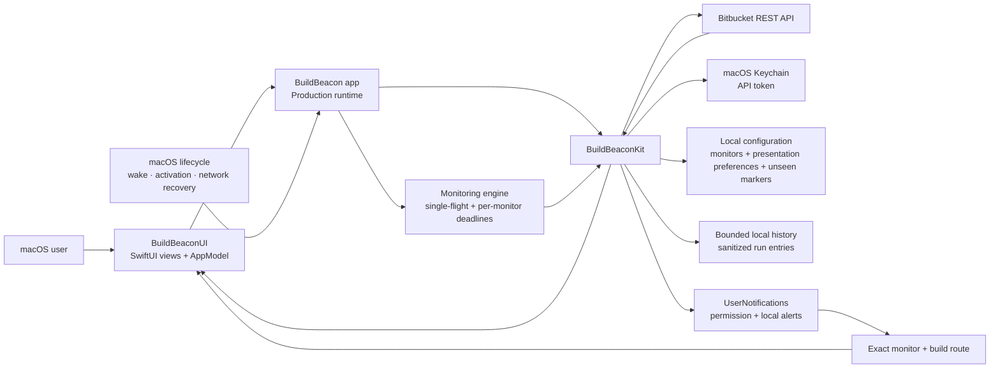
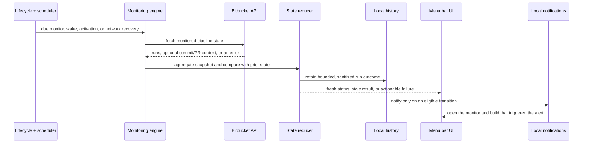

<p align="center">
  
</p>

<h1 align="center">Build Beacon</h1>

<p align="center">
  <strong>Pipeline confidence, quietly visible.</strong><br />
  A native macOS menu bar companion for Bitbucket Pipelines.
</p>

<p align="center">
  <a href="https://github.com/ulissescomonian/build-beacon/releases/tag/v1.0.0-preview.2"></a>
  
  
  
  
  
  
  <a href="LICENSE"></a>
</p>

<p align="center">
  <a href="https://github.com/ulissescomonian/build-beacon/releases/download/v1.0.0-preview.2/Build-Beacon-1.0.0-universal.dmg"><strong>Download Build Beacon 1.0.0 for macOS (.dmg)</strong></a>
  &nbsp;&middot;&nbsp;
  <a href="https://github.com/ulissescomonian/build-beacon/releases/tag/v1.0.0-preview.2">Release notes &amp; SHA-256 checksum</a>
</p>

> [!IMPORTANT]
> **Preview release.** Until a release explicitly says otherwise, builds are local/ad-hoc and are not Developer ID signed or notarized. Follow the release notes and checksum instructions for the exact artifact you download. Never disable Gatekeeper system-wide to open an app.

Build Beacon keeps the most useful Bitbucket Pipeline signal where it belongs: in your menu bar. Connect a scoped, read-only monitoring token, choose the repositories or branches that matter, and see whether work is healthy, running, waiting, or needs attention—without turning a dashboard into another place to babysit. Monitoring remains read-only by default; an isolated per-monitor Action Mode can optionally approve and merge an eligible pull request after explicit confirmation.

## Why Build Beacon

- **Native by design.** Built with Swift 6.2, SwiftUI, AppKit-adjacent system APIs, and a real macOS menu bar experience.
- **One focused workspace.** The Dashboard is a single native window: opening it again restores and focuses the existing workspace instead of creating duplicates. If you keep its Dock icon, clicking it also opens that workspace when it is closed. The app returns to a menu-bar-only presence when the window closes; a tile manually kept in the Dock remains available as a launcher.
- **Quiet, legible status.** A single visual state summarizes your monitored pipelines; detail remains one click away.
- **Always-on awareness.** Monitoring responds to app activation, wake, and genuine network recovery without creating duplicate refresh work.
- **Adaptive, per-monitor polling.** Active runs receive faster checks, approval waits reduce unnecessary pressure, and transient failures back off independently.
- **Project-aware bulk setup.** Filter repositories by Bitbucket project, search, select many, and add them in one atomic operation.
- **A dashboard that makes recency obvious.** The default view sorts by recent activity, shows relative activity time, marks activity you have not yet seen, and still lets you filter, group, search, pin favorites, and inspect retained local run history.
- **Useful transitions.** When alerts are enabled and macOS permission is still undetermined, a contextual notification prompt appears after the first monitor is added; local alerts expose system permission, send a test alert, and route to the exact pipeline run that raised the event. Success alerts are optional, disabled by default, and limited to favorites.
- **Clear run origin and ownership.** Dashboard rows identify whether an execution is a branch run, a pull request, or an unknown source, and show the relevant author when Bitbucket provides it: the PR author for pull-request runs or the commit author for branch runs. Pull-request runs also show their number and source-to-destination route. Relative activity age stays separate from the duration of the latest build.
- **Helpful context when available.** Pipeline detail can surface commit and pull-request context returned by Bitbucket, with safe links back to those resources. Optional PR details never change the classified origin of a branch run.
- **Guided least privilege.** The in-app setup explains the exact Bitbucket scoped-token flow and required read permissions.
- **Opt-in pull-request action.** An allowlisted monitor can offer **Approve and merge** only for an open, non-draft PR whose current source commit has a succeeded monitored build. It never runs from polling, notifications, deep links, or background work.
- **Local-first credentials.** Monitoring and Action Mode use separate API tokens in separate macOS Keychain items, never in preferences, configuration files, or plaintext fallbacks.

## At a glance

| Signal | Meaning |
| --- | --- |
| Healthy | All monitored pipelines have a successful, fresh result. |
| Running | A monitored run is queued or currently executing. |
| Awaiting approval | A monitored run needs an approval decision. |
| Attention required | A monitored run failed, errored, or expired. |
| Data is stale / unavailable | A recent result cannot be refreshed confidently; the app preserves the last known result where appropriate. |
| Unknown / stopped | A non-success result that remains visible for review; it is never presented as healthy. |
| No monitors / connect account | Setup is incomplete, not a pipeline failure. |

Build Beacon recognizes a manual approval gate separately from active work. It
shows **Awaiting approval** when Bitbucket reports a paused manual gate, or when
the first active step of an in-progress pipeline requires a manual trigger.
This keeps active execution, automatic queueing, and a human decision visibly
distinct.

The Approval Center gives those decisions priority over active and healthy work.
It shows how long Build Beacon has observed the wait, which is intentionally a
local detection time rather than a claim about when Bitbucket first required
approval. When available from trusted deployment metadata or an explicit monitor
setting, a **Production** label adds environment context. Build Beacon never
infers production from a branch name such as `main` or `master`.

### Recent activity and unseen work

The default **All** view is ordered by the most recently observed pipeline activity, so a repository that has just completed moves to the top instead of remaining in its setup order. Each row shows a relative activity time (for example, “2 min ago”) rather than a commit hash as its primary recency cue.

The **Recent** filter shows the monitors with activity that is new to you and displays their count. A blue **NEW** marker means Build Beacon has observed a newer pipeline result since you last acknowledged that monitor. Selecting the monitor, opening it from the menu bar, or opening a related notification acknowledges it and clears the marker. This is a local attention cue—not a claim that Bitbucket has delivered a real-time event.

## Getting started

1. Open Build Beacon from the Applications folder or the DMG.
2. Enter the email address for your Atlassian account.
3. In the guided setup, open the Atlassian token page and choose **Create API token with scopes**—not the generic API-token option.
4. Select **Bitbucket**, then grant the four required read scopes below. The optional pull-request scope adds PR context to detail views.
5. Paste the token into Build Beacon and connect.
6. In **Settings → Monitoring**, choose a workspace, filter by project, select one or many repositories, choose a common target, and add them together.

### Required Bitbucket scopes

Build Beacon monitoring is read-only. Create a Bitbucket API token with scopes and enable these required permissions:

```text
read:user:bitbucket
read:workspace:bitbucket
read:repository:bitbucket
read:pipeline:bitbucket
```

For optional pull-request context in pipeline detail, also enable:

```text
read:pullrequest:bitbucket
```

Monitoring works normally without that optional scope; only the related PR context is omitted. When Action Mode is used, however, `read:pullrequest:bitbucket` is required on the monitoring token so the dashboard can associate the exact pull request with the monitored pipeline. The separate Action Mode token revalidates the pull request before each mutation. Do not grant Write or Admin scopes to the monitoring token. If a connected account has no workspaces or repositories available, confirm that the token belongs to the intended Atlassian account and that it has access to those Bitbucket resources.

### Optional Action Mode scopes

Action Mode is off by default and must also be enabled for each monitor. It uses
a second Keychain token with exactly these scopes:

```text
read:user:bitbucket
read:pullrequest:bitbucket
write:pullrequest:bitbucket
```

`read:user:bitbucket` validates that this separate token belongs to the
connected account before any mutation. Do not reuse or broaden the monitoring
token. This credential can only support
the foreground **Approve and merge** flow described below; it cannot approve a
manual pipeline step or enable background automerge.

## Architecture

Build Beacon separates presentation, orchestration, domain rules, and platform integrations. The app target assembles the production runtime; user-interface code has no direct ownership of credentials or network transport.



### Monitoring lifecycle



### Modules

| Module | Responsibility |
| --- | --- |
| `BuildBeaconApp` | App entry point, dependency assembly, lifecycle bridge, dashboard window coordinator, Dock activation policy, and production runtime composition. |
| `BuildBeaconUI` | SwiftUI menu bar, onboarding, settings, dashboard, history and pipeline detail, notification routing, and accessible user interaction. |
| `BuildBeaconKit` | Domain contracts and reducers; Bitbucket client and mapping; adaptive monitoring engine; Keychain, bounded persistence, notifications, links, and logging adapters. |

## Privacy and security

The security model is intentionally narrow:

- The monitoring and Action Mode tokens are stored as separate device-local, non-synchronizable Keychain items.
- Build Beacon does not write either token to UserDefaults, JSON configuration, logs, or a plaintext fallback.
- Selected monitor metadata and presentation preferences stay in local configuration; pipeline snapshots remain in memory. The unseen-activity marker persists only opaque monitor and run identifiers, so it can survive a relaunch without storing commit content or repository display data. Requests are made to Bitbucket only when monitoring requires them.
- Optional local history is bounded to the most recent 20 runs per monitor, 500 entries overall, and 30 days. Its persisted entries contain run identity, status, and timing only—not repository names, branches, commit hashes, failure text, URLs, steps, credentials, payloads, or request metadata.
- The notification ledger is bounded and sanitized to avoid repeat alerts; notifications carry a local route so opening one selects the original monitor and build instead of silently jumping to a newer result.
- Optional approval reminders retain only opaque account, monitor, and run identifiers plus the minimum transition and timing data needed to deduplicate a 10- or 15-minute local reminder. They are cancelled when the build progresses, the monitor is removed, or the account is disconnected.
- Monitoring API access uses only the required read scopes listed above, plus the pull-request read scope when the user enables PR context or Action Mode.
- Action Mode stores only the per-monitor opt-in in configuration. This first version keeps no persistent action audit; Bitbucket remains the source of truth for approval and merge state.
- Disconnecting removes the stored credential, active account configuration, and associated local history.
- Network, rate-limit, malformed-response, and authentication failures are surfaced as actionable states instead of being silently treated as healthy.

To report a vulnerability privately, see [Security](SECURITY.md). Do not include tokens, session material, or personal account data in an issue.

## Requirements

- macOS 14 Sonoma or later
- Apple silicon or Intel Mac (the packaged app is universal: `arm64` and `x86_64`)
- A Bitbucket Cloud account with access to the workspaces and repositories you want to monitor
- A scoped Bitbucket API token with the required read permissions

## Install from a release

1. Download the DMG from the [Build Beacon 1.0.0 Preview 2 release](https://github.com/ulissescomonian/build-beacon/releases/tag/v1.0.0-preview.2).
2. Download the matching `.sha256` file and verify it from the download directory:

   ```bash
   shasum -a 256 -c Build-Beacon-1.0.0-universal.dmg.sha256
   ```

3. Read that release's notes before opening the artifact.
4. Open the DMG and drag **Build Beacon.app** to `/Applications`.
5. Launch the app and complete the guided, read-only token setup.

For Preview builds, macOS may show a provenance or signature warning. Do not disable Gatekeeper system-wide. Instead, only follow the specific verification and opening guidance supplied with the release you downloaded. A future Developer ID signed and notarized release will say so explicitly in its release notes.

## Use it day to day

After connection, Build Beacon lives in the menu bar.

- Click the icon to see the overall health of your monitors and the most relevant recent state.
- Choose **Open Dashboard** for a larger view of monitored pipelines, steps, retained run history, and any available commit or pull-request context. Each row prioritizes the relevant author, its textual source badge, and its branch or pull-request route; workspace context remains available in detail. A pull-request run shows its PR author, number, and source-to-destination route, while a normal branch run shows its commit author and remains identified as a branch. The relative age at the right shows recency, while the third line shows the latest build duration when available and combines it with an actionable step for failed, active, queued, or approval-waiting runs. Repeated requests focus the same dashboard window; if it is minimized, it is restored. If you keep the app in the Dock, clicking it follows that same open-or-focus behavior even when the dashboard is closed. The transient Dock icon disappears when you close the workspace; a tile you manually keep remains as a launcher.
- Use the **Approval Center** to handle manual pipeline gates first. It keeps approval waits visible, can show trusted production context, and provides **Open in Bitbucket** for the exact build. Build Beacon never approves a manual pipeline step. In **Settings → Refresh**, you can opt into one local reminder after 10 or 15 minutes while the same approval remains pending. Reminders stop as soon as that build progresses.
- For an allowlisted monitor, **Approve and merge** appears only when the PR is open, not a draft, and its current source HEAD is the commit of a succeeded monitored build. Every click shows the PR, branches, commit, and build for confirmation. Before approval and again before merge, Build Beacon remotely validates the exact pipeline with the monitoring token and PR/HEAD with the Action Mode token. The app publishes whether it is revalidating, approving, merging, or verifying, and never retries either write automatically. Every ambiguous response after a POST remains unknown, so you must refresh or open the PR before trying again.
- The Dashboard opens in recent-activity order. Use its sidebar and view options to filter by state, **Recent**, or project; search repositories; group or sort monitors; and bring favorites to the top. Rows show relative activity time, while the blue **NEW** marker identifies activity you have not acknowledged yet.
- Use the Settings button in the Dashboard toolbar, **Settings** in the menu bar, or Command-Comma to open the same native Settings window.
- Use **Settings → Monitoring** to filter by project and search repositories before adding them. Choose **Select All Visible** to add a filtered set at once, choose one shared target (**Latest run** or **Default branch**), and confirm it as one atomic operation. Repositories already monitored cannot be selected again. The Advanced section remains available for a specific branch.
- Use **Settings → Refresh** to choose the normal interval: 30 seconds, 1 minute, 2 minutes, 5 minutes, or 15 minutes. Running or queued monitors use an interval no longer than 30 seconds; approval waits use an interval of at least 120 seconds; individual transient failures back off from 30 to 900 seconds.
- Use **Settings → Refresh** to manage failure, recovery, and approval alerts, inspect macOS notification permission, and send a test notification before relying on alerts. Success notifications are opt-in, remain off by default, and notify only for favorite monitors.
- Use **Settings → General** to choose dashboard presentation, retain or clear local history, and optionally open Build Beacon at login.
- Build Beacon refreshes automatically while it is running, even when the dashboard is closed. This is adaptive polling—not a push or real-time subscription—and the dashboard and menu bar present the latest completed refresh.
- Use **Refresh Now** from the menu when you need an immediate check. It still respects Bitbucket rate-limit and retry guidance.
- Use **Settings → Account** to revalidate or disconnect the connected account.

## Build from source

The project is a Swift Package Manager application. Xcode is optional; the macOS command-line developer tools are sufficient.

```bash
git clone https://github.com/ulissescomonian/build-beacon.git
cd build-beacon
swift test
swift run BuildBeacon
```

To create a universal `.app` bundle:

```bash
./scripts/build_app.sh
```

The bundle is written to `dist/Build Beacon.app`. To package the bundle as a DMG:

```bash
./scripts/package_dmg.sh
```

Packaging creates a local artifact; it does not publish a release, notarize the app, or imply Developer ID signing. Inspect the script output and sign artifacts according to the distribution process appropriate for your release.

## Testing

The current suite contains **251 executed tests**, with **0 failures** and **1 opt-in Keychain test skipped** when the local security environment does not permit it.

```bash
swift test
```

The tests cover API mapping and transport behavior, lifecycle and adaptive polling policy, domain-state aggregation and notification policy, account and monitoring orchestration, permission and notification routing, bounded local history and configuration migration (including schema v3 unseen-activity markers, schema v4 approval waits, and ledger v2 reminder records), Keychain behavior, dashboard organization and recent/unseen acknowledgement semantics, reliable optimistic favorites with serial persistence and rollback, and the UI model's onboarding and error presentation.

## Repository layout

```text
.
├── Config/                 App metadata and entitlements
├── Resources/              Public artwork, including menu-bar and Dock app icons
├── Sources/
│   ├── BuildBeaconApp/     Application entry point and runtime assembly
│   ├── BuildBeaconKit/     Domain, API, and macOS service integrations
│   └── BuildBeaconUI/      Native SwiftUI interface
├── Tests/                  Unit and integration-style package tests
├── docs/                   Product decisions, implementation plan, and governance
├── scripts/                Repeatable build, install, and packaging helpers
├── AGENTS.md               Contributor workflow and project guardrails
└── Package.swift           Swift Package Manager manifest
```

## Troubleshooting

| Symptom | What to check |
| --- | --- |
| No workspace appears | Revalidate the account, confirm the token uses **Create API token with scopes**, and verify `read:workspace:bitbucket`. The connected account must also belong to or have access to a workspace. |
| No repository appears | Select a workspace first, then confirm `read:repository:bitbucket` and repository access for that account. |
| Authentication fails | Use the Atlassian account email and a newly created scoped Bitbucket token. Generic API tokens are not a substitute for a Bitbucket API token with scopes. |
| Permission warning | Confirm all four required `read:*:bitbucket` scopes are present; do not add Write/Admin scopes to solve a read-only requirement. |
| Status is stale or unavailable | Check network connectivity and try **Refresh Now**. The app retains the last known state when a safe current result cannot be obtained. |
| Notifications do not appear | Enable alerts in **Settings → Refresh**, check the displayed macOS permission state, then use the built-in test notification. |
| A notification opens an older build | This is intentional: the alert routes to the specific build that caused it, even if a newer refresh has since completed. |
| No history is visible | Confirm **Record pipeline history** is enabled. History begins after it is enabled and is retained locally within its bounded policy. |
| Token was revoked or expired | Create a new scoped token, then revalidate the account in Settings. |

## Preview limitations

Build Beacon 1.0.0 is a Preview release. It focuses on native, read-only-by-default Bitbucket Pipeline observation, purposeful local notifications, and one isolated foreground pull-request action when explicitly enabled. It does not claim automatic updates, release publishing, general Bitbucket write operations, background automerge, Developer ID signing, notarization, or hosted synchronization. Treat release notes as the source of truth for the artifact and distribution guarantees of a particular version.

## Contributing

Contributions are welcome. Please read [Contributing](CONTRIBUTING.md) and [AGENTS.md](AGENTS.md) before opening an issue or pull request, keep changes focused, record material decisions in `docs/`, add or update tests when behavior changes, and never include API tokens, workspace data, or other credentials in commits.

## Security

Security guidance and private reporting instructions are available in [SECURITY.md](SECURITY.md).

## License

Build Beacon is available under the [MIT License](LICENSE).
