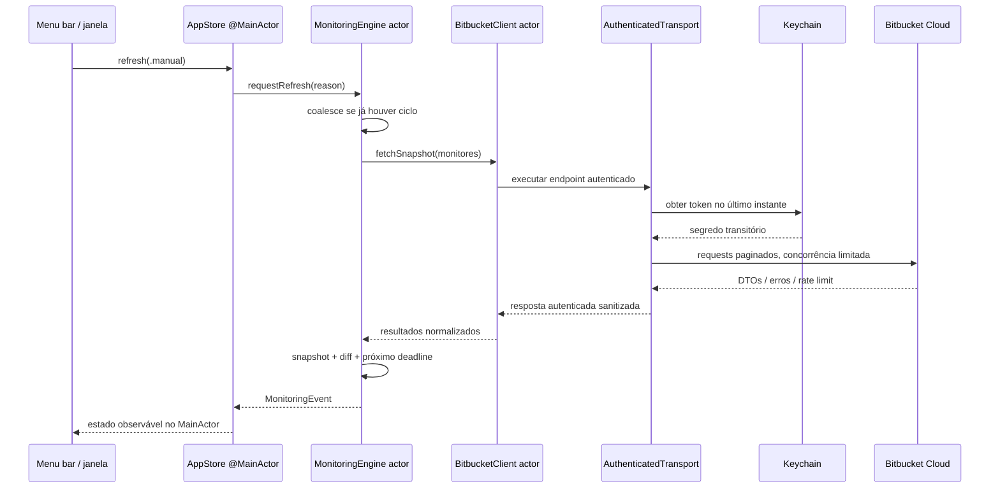

# Build Beacon — discussão de produto e arquitetura

**Status:** arquitetura implementada; Preview 1.0.0 preparada para publicação
**Data-base:** 21 de julho de 2026
**Plataforma:** macOS 14 ou superior
**Tecnologia:** Swift 6, SwiftUI e APIs nativas do macOS

## 1. Decisão executiva

Build Beacon será um aplicativo de menu bar exclusivo para macOS que monitora
pipelines do Bitbucket Cloud, comunica mudanças relevantes sem exigir que o
usuário mantenha uma janela aberta e oferece uma visualização detalhada para
diagnóstico e ações manuais.

A implementação será integralmente nova e independente. A análise de um
aplicativo de referência serviu apenas para descobrir problemas do domínio,
fluxos úteis e armadilhas técnicas. Não serão reutilizados código, estrutura de
arquivos, textos, marca, ícones, imagens, CSS, HTML, nomes internos ou qualquer
outro elemento expressivo da referência.

As decisões centrais são:

1. aplicativo nativo em Swift 6, sem runtime web, Rust, Electron ou Tauri;
2. `MenuBarExtra` como entrada principal e cenas SwiftUI nativas para ajustes e
   detalhes;
3. `URLSession` + `Codable` para a API Bitbucket Cloud;
4. API Token como autenticação inicial, armazenado exclusivamente no Keychain;
5. domínio independente da API e da interface;
6. polling coordenado por um `actor`, com uma única atualização em voo,
   cancelamento, backoff e respeito a rate limits;
7. erro, dado ausente e estado desconhecido nunca significam “saudável”;
8. assinatura Developer ID, Hardened Runtime e notarização antes da primeira
   distribuição pública.

## 2. Método clean-room e limites de reutilização

### 2.1 O que a análise pode aproveitar

- a existência do problema: acompanhar pipelines sem manter o navegador aberto;
- conceitos abstratos como repositório, branch, execução, etapa e saúde agregada;
- comportamentos observáveis e expectativas comuns de um monitor de CI;
- documentação pública da API Bitbucket e documentação pública da Apple;
- lições negativas identificadas durante a auditoria.

### 2.2 O que não será aproveitado

- nenhuma linha de código ou tradução mecânica entre linguagens;
- nenhum texto de interface, documentação ou mensagem de erro;
- nenhum asset, paleta, layout, ícone, nome ou identidade visual;
- nenhuma organização interna tomada como blueprint;
- nenhuma dependência ou atalho escolhido apenas por existir na referência.

### 2.3 Registro de independência

Toda funcionalidade deverá estar ligada a um requisito deste documento, a uma
fonte pública da plataforma ou a uma decisão explícita do Build Beacon. Pull
requests futuras não devem citar nem anexar trechos do aplicativo analisado. Se
uma decisão não puder ser justificada independentemente, ela deve ser redesenhada.

Essa política reduz o risco de incorporar expressão de terceiros e mantém a
rastreabilidade das decisões próprias. O produto e sua documentação devem
permanecer autocontidos, mas esse processo de engenharia não substitui revisão
jurídica quando ela for necessária.

## 3. Entendimento profundo do problema

### 3.1 Trabalho que o usuário quer realizar

O usuário quer responder rapidamente a cinco perguntas:

1. Existe alguma pipeline quebrada agora?
2. Alguma execução está em andamento ou aguardando aprovação?
3. Qual repositório, branch, build e etapa exigem atenção?
4. O estado mudou desde a última verificação confiável?
5. Posso abrir o contexto correto ou executar uma ação segura sem procurar
   manualmente no navegador?

O valor do produto não é “mostrar bolinhas coloridas”. É reduzir o tempo entre
uma mudança de CI e a percepção humana correta, sem produzir alarmes falsos.

### 3.2 Personas iniciais

- **Desenvolvedor individual:** acompanha poucos repositórios e quer feedback
  discreto sobre a branch em que trabalha.
- **Tech lead:** acompanha vários projetos e precisa identificar rapidamente o
  repositório que degradou a saúde do conjunto.
- **Responsável por release:** observa etapas de deploy, especialmente pausas
  para aprovação e falhas após promoção.
- **Operador:** precisa de informação confiável, histórico recente e distinção
  clara entre falha da pipeline e falha do monitor.

### 3.3 Escopo funcional do primeiro produto útil

- configurar conta Bitbucket Cloud com e-mail Atlassian e API Token;
- validar autenticação e permissões sem persistir o token fora do Keychain;
- navegar por workspaces, projetos e repositórios com paginação completa;
- selecionar repositórios e, opcionalmente, branches específicas;
- buscar a execução mais recente que realmente corresponda ao filtro;
- agregar saúde e representar o resultado no menu bar;
- exibir detalhes por projeto, repositório, branch, build e etapa;
- abrir pipeline, commit e repositório no navegador padrão;
- notificar transições relevantes, não estados repetidos;
- permitir refresh manual sem criar atualizações concorrentes;
- abrir o contexto de aprovação no navegador; execução remota pelo app fica
  pós-1.0 e só entra com endpoint público, permissão e idempotência comprovados;
- configurar intervalo, notificações, início no login e comportamento visual.

### 3.4 Fora do MVP

- suporte a Windows ou Linux;
- suporte simultâneo a outros provedores de CI;
- servidor próprio, sincronização em nuvem ou telemetria remota;
- edição de configuração de pipelines;
- criação, cancelamento ou rerun genérico de builds;
- gráficos históricos de longa duração;
- atualização automática implementada de forma artesanal;
- armazenamento do token em iCloud Keychain por decisão implícita;
- suporte a múltiplas contas no primeiro release.

## 4. Comportamentos observados e lições de engenharia

A análise revelou um conjunto pequeno de capacidades úteis e uma quantidade
relevante de riscos. As capacidades viram requisitos independentes; as falhas
viram invariantes que o Build Beacon deve testar.

### 4.1 Capacidades conceituais úteis

- presença permanente na menu bar, sem ícone no Dock;
- estado agregado visível sem abrir uma janela;
- agrupamento por projeto;
- monitoramento opcional por branch;
- refresh configurável e refresh manual;
- notificação de falha e recuperação;
- visualização das etapas da execução mais recente;
- reconhecimento de etapa pausada aguardando ação;
- links para pipeline e commit;
- persistência da seleção monitorada.

### 4.2 Falhas que não podem ser herdadas

| Área | Problema encontrado | Consequência | Decisão Build Beacon |
|---|---|---|---|
| Segredos | segredo apenas codificado em Base64 em arquivo | leitura trivial por outro processo/backup | Keychain, nunca `UserDefaults` ou arquivo |
| Segredos | segredo devolvido para a camada de UI | aumenta superfície de exposição | somente `CredentialStore` e cliente HTTP acessam o token |
| Auth | modelo antigo de username + app password | incompatibilidade durante retirada do mecanismo legado | e-mail Atlassian + API Token escopado |
| Polling | temporizador recriado de modo que o primeiro tick é imediato | loop apertado e excesso de requisições | scheduler monotônico, deadline explícito |
| Concorrência | refresh manual pode sobrepor o automático | resposta antiga pode sobrescrever nova | single-flight com coalescência |
| Paginação | campo `next` existe, mas é ignorado | workspaces/repos/steps desaparecem | seguir `next` até o fim, com limite defensivo |
| Branch | filtro local em uma janela pequena de builds recentes | branch válida parece não ter execução | filtro server-side quando suportado; paginação limitada e explícita como fallback |
| Saúde | apenas falha explícita torna o agregado não saudável | erro de rede aparece verde | saúde separada de frescor/confiabilidade |
| Estados | estados novos ou incompletos caem em sucesso | falso positivo perigoso | decoder tolerante + `.unknown(rawValue:)` |
| Identidade | comparação ignora branch | notificações e estados colidem | identidade inclui workspace, repo e ref |
| UI dinâmica | menu só muda quando comparação parcial detecta alteração | URLs, build e motivo ficam obsoletos | snapshot versionado e diff semântico completo |
| Sequência | comparação por posição | reordenação produz diffs falsos | comparação por `MonitorID` |
| Rede | requisições por repositório em série | latência cresce linearmente | concorrência limitada e justa |
| Erros | erros são convertidos em strings genéricas | UI não sabe orientar recuperação | taxonomia `AppError` tipada |
| Persistência | escrita direta não atômica | arquivo truncado em crash | escrita atômica e migração versionada |
| Logs | risco de incluir URL/resposta sensível | vazamento de metadados/token | `Logger` com privacy e redaction |
| Testes | nenhum teste automatizado observado | regressões silenciosas | pirâmide de testes obrigatória |
| Distribuição | não foi encontrado gate verificável de assinatura/notarização | risco de Gatekeeper e baixa confiança | Developer ID + notarização como gate |
| Acessibilidade | cor e HTML como sinais principais | baixa legibilidade/VoiceOver | símbolo, texto, forma e acessibilidade nativa |

## 5. Semântica de domínio própria

### 5.1 Identificadores

Identidade não deve depender de nomes exibidos nem da ordem da API.

```swift
struct MonitorID: Hashable, Codable, Sendable {
    let accountID: AccountID
    let workspaceUUID: String
    let repositoryUUID: String
    let target: MonitorTarget
}

enum MonitorTarget: Hashable, Codable, Sendable {
    case repositoryLatest
    case defaultBranch
    case branch(exactName: String)
}
```

UUIDs remotos são identidade; slugs e nomes são metadata mutável de apresentação
e construção de URL. `.repositoryLatest` acompanha a execução mais recente de
qualquer branch. `.defaultBranch` acompanha a branch que o repositório declarar
como padrão a cada consulta, sem mudar a identidade do monitor.
`.branch(exactName:)` preserva capitalização e acompanha somente aquela branch.
Rename de workspace/repo deve reconciliar metadata pelo UUID, sem duplicar o
monitor ou perder seu baseline.

O identificador de uma execução usa UUID da API. O número do build é dado de
exibição e não chave universal. Etapas usam UUID próprio e permanecem associadas
ao UUID da execução.

### 5.2 Estado normalizado da pipeline

```swift
enum PipelinePhase: Equatable, Sendable {
    case queued
    case running
    case awaitingApproval
    case succeeded
    case failed
    case errored
    case expired
    case stopped
    case unknown(remoteState: String?, remoteResult: String?)
}
```

Somente `SUCCESSFUL` explícito produz `succeeded`. `STOPPED`, `ERROR`, `EXPIRED`
e `FAILED` permanecem distinguíveis, com motivo detalhado em campo separado. Um
estado desconhecido preserva os valores remotos e nunca é convertido
silenciosamente em sucesso.

### 5.3 Estado da observação

O estado da pipeline e a qualidade da observação são eixos diferentes:

```swift
struct MonitorObservation: Equatable, Sendable {
    var lastKnownRun: PipelineRun?
    var attemptedAt: Date?
    var lastSuccessfulObservationAt: Date?
    var currentFailure: AppError?
}
```

Assim, “a última execução conhecida terminou com sucesso, mas não conseguimos
consultar o servidor há 20 minutos” não aparece como simplesmente verde.
Frescor é derivado desses campos: sem baseline + erro é `unavailable`; com
baseline + erro é `stale` com causa. O limiar inicial será
`max(2 × intervalo configurado, 120 segundos)`, com teto de 15 minutos, e será
validado em testes de produto.

### 5.4 Saúde agregada

Ordem de severidade provisória, a congelar em M0 antes do reducer:

1. `attentionRequired`: falha ou erro confirmado;
2. `unavailable`: nenhuma leitura confiável para pelo menos um monitor;
3. `stale`: dados conhecidos ultrapassaram o limite de frescor;
4. `awaitingApproval`: ação manual aguardando;
5. `running`: uma ou mais execuções ativas, sem falhas;
6. `healthy`: todas as observações frescas e execuções concluídas com sucesso;
7. `configuredWithoutMonitors`: conta conectada, mas nenhum monitor selecionado;
8. `notConnected`: conta ausente ou credencial removida.

Essa ordem é uma decisão de produto. O usuário poderá optar futuramente por
tratar “aguardando aprovação” acima de “stale”, mas falha e indisponibilidade não
podem ser mascaradas.

### 5.5 Snapshot e diff

Cada ciclo produz um `MonitoringSnapshot` imutável contendo:

- `cycleID` UUID;
- horário de início e conclusão;
- origem (`startup`, `scheduled`, `manual`, `retry`, `wake`);
- resultados indexados por `MonitorID`;
- falhas parciais;
- rate-limit observado e próximo refresh elegível;
- saúde agregada derivada;
- indicador de completude do ciclo.

O `SnapshotDiff` completo compara por identidade e inclui fase, execução, etapa,
motivo, URL canônica, frescor e presença; ele atualiza UI e links. Uma
`NotificationPolicy` separada deriva apenas eventos notificáveis desse diff.
Mudança de URL, label ou frescor pode reconstruir a UI sem gerar alerta.

## 6. Arquitetura nativa proposta

### 6.1 Estilo arquitetural

Arquitetura em camadas com fluxo unidirecional e dependências apontando para o
domínio:

```text
BuildBeaconApp / Features
          ↓
      Application ports
          ↓
        Domain
          ↑
Infrastructure adapters (Bitbucket, Keychain, persistence, notifications)
```

- **Domain:** tipos, regras de agregação e transições; sem SwiftUI, Keychain,
  protocolos de infraestrutura ou DTOs HTTP.
- **Application:** casos de uso, ports, store principal, scheduler, diff e
  coordenação.
- **BitbucketAPI:** transportes, DTOs, paginação, autenticação e mapeadores.
- **Infrastructure:** Keychain, preferências, notificações, login item, relógio,
  abertura de URLs e logging.
- **Features:** menu bar, onboarding, seleção, dashboard, detalhe e settings.
- **BuildBeaconApp:** composição de dependências e cenas.

### 6.2 APIs Apple

| Necessidade | API nativa |
|---|---|
| menu bar | SwiftUI `MenuBarExtra` |
| janelas | `Window`, `Settings`, `openWindow` |
| ciclo do app | SwiftUI `App`, `NSApplication` somente para integração inevitável |
| rede | `URLSession`, `URLRequest`, `HTTPURLResponse` |
| decodificação | `Codable`, `JSONDecoder` |
| segredos | Security.framework / Keychain Services |
| notificações | UserNotifications.framework |
| início no login | ServiceManagement `SMAppService` |
| abertura externa | `NSWorkspace.open` após validação de URL |
| logs | `OSLog.Logger` com privacy |
| persistência | configuração versionada em Application Support; `UserDefaults` só para estado efêmero de UI |
| concorrência | Swift structured concurrency, actors e `TaskGroup` |
| testes | Swift Testing/XCTest e `URLProtocol` controlado |

`MenuBarExtra` existe justamente para controles persistentes na menu bar e será
preferido a uma implementação manual com `NSStatusItem`. AppKit só entra se um
comportamento de menu bar não puder ser entregue corretamente pela API SwiftUI.

### 6.3 Estrutura inicial de módulos

```text
BuildBeacon/
├── App/
├── Domain/
│   ├── Models/
│   ├── Policies/
│   └── Ports/
├── Application/
│   ├── Monitoring/
│   ├── Onboarding/
│   └── State/
├── BitbucketAPI/
│   ├── Authentication/
│   ├── DTO/
│   ├── Endpoints/
│   ├── Mapping/
│   └── Transport/
├── Infrastructure/
│   ├── Credentials/
│   ├── Persistence/
│   ├── Notifications/
│   ├── LoginItem/
│   └── Logging/
├── Features/
│   ├── MenuBar/
│   ├── Onboarding/
│   ├── MonitorSelection/
│   ├── Dashboard/
│   ├── PipelineDetail/
│   └── Settings/
└── Resources/
```

No início, esses caminhos podem ser grupos de um único target para reduzir
complexidade. A fronteira é lógica e testável; módulos Swift separados só serão
extraídos quando trouxerem ganho real de build ou isolamento.

## 7. Fluxo de dados e concorrência



### 7.1 Invariantes de concorrência

- exatamente um ciclo de refresh em voo;
- refresh manual durante ciclo ativo é coalescido em, no máximo, um ciclo
  subsequente;
- resposta de ciclo antigo nunca substitui snapshot mais novo;
- cancelamento de logout, troca de conta ou encerramento propaga para requests;
- mutações da UI ocorrem no `MainActor`;
- token não sai do `AuthenticatedTransport`, não atravessa API pública nem
  aparece em eventos;
- concorrência de rede é limitada, inicialmente a quatro repositórios;
- resultados parciais são preservados com erro por monitor;
- scheduler calcula deadline a partir do fim do ciclo, evitando loop imediato;
- wake do Mac agenda refresh com jitter, não uma tempestade instantânea.

### 7.2 Estratégia de polling

Intervalo padrão: 60 segundos. Mínimo inicial: 30 segundos. O intervalo efetivo
pode ser maior devido a backoff, `Retry-After`, suspensão do Mac ou modo de baixo
consumo.

Algoritmo:

1. aguardar configuração válida;
2. executar refresh inicial;
3. calcular `nextEligibleAt = completedAt + configuredInterval`;
4. incorporar eventual `Retry-After` e backoff;
5. suspender com `ContinuousClock.sleep(until:tolerance:)`;
6. ao receber refresh manual, acordar/coalescer sem duplicar ciclo;
7. ao acordar do sleep do sistema, invalidar apenas frescor e atualizar;
8. em erro transitório, aplicar exponencial com jitter e teto;
9. em 401/403, pausar polling e apresentar ação de recuperação;
10. em 429, obedecer o servidor e não martelar a API.

## 8. Contrato com Bitbucket Cloud

### 8.1 Autenticação em julho de 2026

App passwords estão em retirada e não serão suportados pelo Build Beacon. Em 21
de julho de 2026, páginas oficiais divergiam entre brownouts iniciados em 9 de
junho e remoção permanente em 28 de julho; essa divergência reforça a decisão de
não implementar legado. O único contrato do produto será REST API com
**e-mail da conta Atlassian + API Token** escopado. Fontes oficiais:

- [Using API tokens](https://support.atlassian.com/bitbucket-cloud/docs/using-api-tokens/)
- [Diagnóstico de 401 e transição para API Tokens](https://support.atlassian.com/bitbucket-cloud/kb/getting-401-http-error-while-authenticating-to-bitbucket-cloud-rest-apis/)
- [Permissões de API Token](https://support.atlassian.com/bitbucket-cloud/docs/api-token-permissions/)

OAuth é preferível para uma integração pública quando houver um fluxo apropriado
a cliente desktop. Entretanto, um segredo de OAuth embutido no binário não é
seguro. OAuth só entra quando for possível usar um fluxo adequado a cliente
público ou um broker próprio; nenhum dos dois será improvisado no MVP.

### 8.2 Scopes mínimos

O onboarding deve explicar os scopes necessários sem pedir privilégios amplos:

- leitura da conta/workspaces;
- leitura de repositórios;
- leitura de pipelines;
- leitura de usuário para validação, se o fluxo adotado exigir;
- escrita de pipelines somente em uma evolução pós-1.0 aprovada.

Os nomes exatos dos scopes serão validados contra a documentação oficial no
momento da implementação, pois podem mudar. O modo somente leitura é o padrão.

### 8.3 Endpoints conceituais

- usuário atual para validação;
- workspaces acessíveis ao usuário;
- repositórios de workspace, usando a metadata de projeto embutida; listagem
  independente de projetos só entra se o endpoint público for comprovado;
- refs/branches quando necessárias à seleção;
- pipelines de repositório, ordenadas da mais recente;
- etapas de uma execução;
- ação de etapa pausada, se suportada e autorizada.

Referências oficiais:

- [Workspaces REST API](https://developer.atlassian.com/cloud/bitbucket/rest/api-group-workspaces/)
- [Pipelines REST API](https://developer.atlassian.com/cloud/bitbucket/rest/api-group-pipelines/)
- [Bitbucket Cloud changelog](https://developer.atlassian.com/cloud/bitbucket/changelog/)

### 8.4 Paginação

Todo endpoint paginado passa por um `Paginator` comum:

- aceita a primeira URL construída pelo app;
- segue apenas `next` com `https`, host `api.bitbucket.org` e path permitido;
- acumula valores sem duplicar UUIDs;
- impõe teto defensivo de páginas/itens;
- respeita cancelamento;
- registra métricas locais sem conteúdo sensível;
- detecta ciclo de URLs;
- retorna resultado parcial somente quando o caso de uso aceitar isso.

### 8.5 Cliente HTTP

Requisitos:

- `URLSessionConfiguration.ephemeral` com `urlCredentialStorage`, `urlCache` e
  `httpCookieStorage` desabilitados explicitamente;
- App Transport Security sem exceções;
- timeout de request e de recurso distintos;
- `Accept: application/json` e `User-Agent` próprio;
- header de autenticação criado no último instante e descartado após a request;
- validação de status antes da decodificação de sucesso;
- limite de tamanho por `Content-Length` e cancelamento de streaming ao exceder
  o teto real;
- decodificação tolerante a campos adicionais;
- mensagens do servidor sanitizadas antes de chegar à UI;
- redirects autenticados cross-origin e downgrade HTTP bloqueados;
- retry somente para operações idempotentes, salvo prova contrária;
- `Retry-After` em 429/503 quando presente e backoff com jitter quando ausente;
- nenhuma URL arbitrária fornecida pela API é aberta sem validação.

## 9. Segurança e privacidade

### 9.1 Keychain

O token será um item `kSecClassGenericPassword` com service baseado no bundle ID
e account baseado no identificador estável da conta. Requisitos:

- política inicial `WhenUnlockedThisDeviceOnly`: polling pausa com a tela
  bloqueada e retoma após unlock; um spike pode justificar
  `AfterFirstUnlockThisDeviceOnly` somente com decisão de produto explícita;
- `kSecAttrSynchronizable = false`, sem access group desnecessário;
- update idempotente;
- exclusão no logout;
- erro de Keychain tipado;
- nenhum fallback para texto puro;
- testes de integração cobrindo save/read/update/delete;
- redaction de token e Authorization em qualquer diagnóstico.

A Apple descreve o Keychain como armazenamento criptografado para pequenos
segredos: [Keychain Services](https://developer.apple.com/documentation/security/keychain-services/).

### 9.2 Dados locais

Preferências não secretas:

- conta identificada apenas pelo e-mail necessário à autenticação;
- monitores selecionados;
- intervalo e preferências de notificação;
- configuração de janela e início no login;
- último snapshot opcional, sanitizado e com retenção curta.

Não persistir logs de resposta, bodies, headers, token, YAML, variáveis ou
artefatos de pipeline.

### 9.3 Threat model resumido

| Ameaça | Mitigação |
|---|---|
| leitura do token em disco | Keychain; nenhum fallback |
| token em log/crash | tipos que ocultam descrição; privacy `.private` |
| URL maliciosa em resposta | allowlist de scheme/host e construção local |
| resposta enorme | limites de tamanho/páginas |
| MITM | ATS/TLS padrão, sem desabilitar validação |
| ação manual acidental | confirmação, contexto completo e scope opcional |
| request replay/duplicada | single-flight e idempotência explícita |
| supply chain | inventário de SDK/CI/scripts/certificados, CI protegida, artefatos imutáveis e assinatura/notarização |
| config corrompida | schema versionado, escrita atômica, backup recuperável |

## 10. Experiência nativa para macOS

### 10.1 Menu bar

O ícone deve funcionar em claro/escuro, aumento de contraste e tinting do macOS.
Em vez de depender de cor, usar SF Symbols e formas distintas:

- saudável: `checkmark.circle`;
- executando: `arrow.trianglehead.2.clockwise.rotate.90`;
- aguardando: `pause.circle`;
- falha: `exclamationmark.octagon`;
- indisponível/stale: `wifi.exclamationmark` ou `questionmark.circle`;
- não configurado: `gearshape`.

O label precisa de texto de acessibilidade. Cor pode reforçar o significado em
conteúdo rico, mas nunca ser o único canal.

Conteúdo proposto:

- resumo da saúde e horário/frescor;
- grupos por projeto;
- itens com repositório, branch e estado;
- “Atualizar agora” com progresso e atalho;
- “Abrir painel”;
- “Ajustes…”;
- “Sair”.

Para escala, o menu mostrará primeiro itens que exigem atenção, depois itens em
execução, até um limite inicial de 12 entradas. O restante será resumido em
“Mostrar todos no painel”. A ordem permanece estável enquanto o menu estiver
aberto; contas grandes não geram centenas de itens.

### 10.2 Onboarding

Fluxo em quatro passos:

1. explicar o que será acessado e onde o token ficará;
2. receber e-mail Atlassian e API Token em `SecureField`;
3. validar conta e scopes, distinguindo 401 de 403;
4. selecionar monitores com busca, paginação e seleção múltipla.

O token não será repopulado na interface. A tela informa apenas que uma
credencial existe e oferece “Substituir token” ou “Desconectar”.

### 10.3 Painel

Sidebar opcional por projeto e lista principal com:

- repositório e branch;
- estado textual e símbolo;
- número da execução;
- commit abreviado e horário;
- duração quando disponível;
- qualidade/frescor da observação;
- mensagem de erro recuperável;
- ações contextuais nativas.

### 10.4 Detalhe de pipeline

Em vez de reproduzir uma fileira HTML, usar composição própria:

- cabeçalho com repo, branch, build, commit e timestamps;
- `List`/`ScrollView` de etapas com símbolo, status, duração e hierarquia;
- indicação de sequência/dependência apenas se os dados da API sustentarem essa
  interpretação;
- seleção por teclado e menu contextual;
- link destacado para resolver aprovação no navegador; ação remota nativa é uma
  evolução pós-1.0 protegida por capability flag;
- botão para abrir a fonte oficial no navegador.

### 10.5 Estados de interface obrigatórios

Cada feature deve definir explicitamente:

- nunca carregado;
- carregando inicialmente;
- atualizando com dados anteriores visíveis;
- conteúdo vazio legítimo;
- sucesso;
- dados parciais;
- stale;
- sem rede;
- autenticação expirada/inválida;
- permissão insuficiente;
- rate limited com próximo horário;
- erro de decodificação/API alterada.

### 10.6 Acessibilidade e localização

- VoiceOver em todos os símbolos, status e ações;
- navegação completa por teclado;
- foco previsível após add/remove/erro;
- Dynamic Type onde macOS aplicar;
- Reduce Motion e Increase Contrast;
- não usar apenas cor;
- strings em `String Catalog` desde o primeiro commit;
- português e inglês podem ser entregues incrementalmente, sem texto hardcoded;
- datas/durações por `FormatStyle`, nunca strings montadas manualmente.

### 10.7 Settings e lifecycle

A cena `Settings` terá Account, Monitoring, Refresh & Notifications, General e
Diagnostics. A primeira execução abre onboarding automaticamente. Cancelar deixa
um item de menu recuperável para retomar; não deixa loading infinito. Onboarding,
dashboard e settings têm uma instância por tipo, com foco da existente. Fechar
oculta a janela sem encerrar o app; Quit, logout e troca de conta cancelam tasks.
Posição/tamanho são respeitados. Clique em notificação deve rotear corretamente
tanto em processo ativo quanto em cold launch.

## 11. Notificações

Solicitar autorização apenas quando o usuário habilitar notificações ou concluir
o onboarding com explicação contextual.

Transições notificáveis:

- não-falha → falha;
- falha → sucesso;
- qualquer estado → aguardando aprovação, se habilitado;
- indisponibilidade prolongada, uma vez por janela de silêncio;
- autenticação inválida, sem repetição a cada ciclo.

Não notificar:

- estado inicial sem baseline;
- falha repetida sem mudança de build/causa;
- refresh manual que confirma o mesmo estado;
- oscilações causadas apenas por request parcial.

As notificações usarão `UNUserNotificationCenter`, deep link interno seguro e
ações limitadas a abrir/atualizar. Aprovação de deploy não ocorrerá direto de
uma notificação. Para garantir deduplicação entre relançamentos, um ledger
sanitizado e atômico persistirá somente monitor ID, run ID, transição e horário,
com retenção limitada.

## 12. Persistência e migração

### 12.1 Separação

- Keychain: token;
- Application Support: fonte única da configuração estruturada versionada,
  incluindo conta, monitores, intervalo e notificações;
- `UserDefaults`: somente estado efêmero de UI que as APIs de cena não
  preservarem;
- Application Support: ledger de notificações e, se aprovado, último snapshot
  sanitizado, em envelopes separados;
- memória: DTOs, respostas e snapshots completos do ciclo corrente.

### 12.2 Schema

```swift
struct PersistedConfigurationV1: Codable, Sendable {
    let schemaVersion: Int
    var accountEmail: String?
    var monitors: [PersistedMonitor]
    var refreshIntervalSeconds: Int
    var notifications: NotificationPreferences
}
```

Decodificação valida limites, normaliza slugs, remove duplicatas por `MonitorID`
e preserva um backup antes de migração destrutiva.

## 13. Tratamento de erros

Taxonomia mínima:

```swift
enum AppError: Error, Equatable, Sendable {
    case notConfigured
    case invalidCredentials
    case insufficientPermissions(required: Set<Scope>)
    case rateLimited(retryAt: Date?)
    case offline
    case timedOut
    case server(status: Int, requestID: String?)
    case malformedResponse(endpoint: EndpointKind)
    case resourceNotFound(ResourceID)
    case keychain(KeychainFailure)
    case persistence(PersistenceFailure)
    case cancelled
    case unexpected
}
```

A UI mapeia erros para título, explicação e ação. O domínio não contém texto de
interface. Detalhes técnicos sanitizados ficam disponíveis em “Copiar
diagnóstico”, sem segredo ou payload privado.

## 14. Performance e eficiência

Metas iniciais, a validar em hardware Intel e Apple Silicon:

- app ocioso abaixo de 100 MB de memória;
- CPU praticamente zero entre ciclos;
- nenhuma wakeup periódica fora do scheduler configurado;
- menu abre em menos de 150 ms com snapshot em memória;
- refresh de 20 monitores usa concorrência limitada, não serial completa nem
  fan-out ilimitado;
- máximo de uma reconstrução visível por snapshot;
- nenhuma consulta de etapas para pipelines não abertas/selecionadas, exceto se
  necessária para detectar aprovação;
- Instruments para Time Profiler, Allocations, Leaks e Energy Log antes do beta.

## 15. Observabilidade local

Categorias `Logger`:

- lifecycle;
- authentication;
- networking;
- monitoring;
- persistence;
- notifications;
- userAction.

Cada ciclo usa `cycleID`; cada request usa endpoint abstrato e request ID do
servidor quando disponível. E-mail, workspace, repo, branch e commit são privados
por padrão. Token e Authorization nunca são logados, mesmo em debug.

O diagnóstico exportável deverá conter versões, timestamps, categorias de erro,
contagens, intervalos e configuração não sensível. Exportar nomes de repositório
exige consentimento explícito.

## 16. Distribuição macOS

### 16.1 Canal inicial recomendado

Distribuição direta fora da Mac App Store:

- bundle ID próprio;
- Apple Developer Program;
- certificado Developer ID Application;
- Hardened Runtime;
- App Sandbox habilitado, com entitlement mínimo de rede de saída; Keychain,
  notificações, links, export de diagnóstico e `SMAppService` precisam passar
  por um protótipo assinado no início;
- archive universal arm64 + x86_64 enquanto Intel fizer parte do suporte;
- assinatura de todos os componentes;
- notarização e stapling;
- DMG assinado e checksum publicado;
- teste em usuário/mac limpo sem certificados de desenvolvimento.

Documentação Apple relevante:

- [Security](https://developer.apple.com/documentation/security/)
- [Notarizing macOS software before distribution](https://developer.apple.com/documentation/security/notarizing-macos-software-before-distribution/)
- [MenuBarExtra](https://developer.apple.com/documentation/swiftui/menubarextra)

### 16.2 Atualizações

Para preservar a meta de stack nativa e reduzir risco de supply chain, o MVP não
terá updater próprio. O app pode verificar metadados assinados e abrir a página
oficial de download em uma fase posterior. Atualização automática exige design
separado de assinatura, rollback e proteção contra downgrade.

## 17. Decisões arquiteturais propostas

| ID | Decisão | Justificativa | Revisitar quando |
|---|---|---|---|
| ADR-001 | macOS 14+ | Observation e SwiftUI maduros, alcance razoável | dados de usuários exigirem macOS 13 |
| ADR-002 | Swift 6 strict concurrency | elimina classes inteiras de race | nunca reduzir; apenas corrigir warnings |
| ADR-003 | MenuBarExtra + cenas SwiftUI | experiência nativa e acessível | limitação comprovada exigir NSStatusItem |
| ADR-004 | API Token no MVP | fluxo suportado e implementável sem backend | OAuth seguro para cliente público disponível |
| ADR-005 | Keychain obrigatório | segredo real, sem fallback inseguro | nunca |
| ADR-006 | domínio separado de DTOs | tolerância a mudança de API e testabilidade | nunca |
| ADR-007 | actor single-flight | evita tempestade e resultado fora de ordem | nunca |
| ADR-008 | snapshot imutável + diff | UI e notificações consistentes | nunca |
| ADR-009 | zero dependências de runtime no MVP | natividade e supply chain reduzida | benefício mensurável justificar pacote |
| ADR-010 | Developer ID + notarização | instalação confiável | canal App Store aprovado |
| ADR-011 | 1.0 somente leitura | endpoint de aprovação não está comprovado publicamente | contrato público e threat model aprovados |
| ADR-012 | App Sandbox no 1.0 | contenção e entitlements explícitos | bloqueio técnico comprovado por spike |
| ADR-013 | monitoramento read-only com `Approve and merge` opt-in isolado | reduz o atrito de PRs prontas sem dar capacidade de mutação ao polling; separa a credencial de ação com três scopes mínimos e exige dois preflights remotos completos | novo endpoint write, mudança dos scopes mínimos ou falha do contrato de preflight exigir revisão |

## 18. Riscos e mitigação

| Risco | Probabilidade | Impacto | Mitigação |
|---|---:|---:|---|
| mudança de auth/API Bitbucket | alta | alta | camada de adapter, changelog e contract tests |
| scopes insuficientes/confusos | média | alta | validator de capacidade por endpoint |
| rate limit com muitos repos | alta | alta | paginação, concorrência limitada, backoff e cache |
| estado desconhecido marcado como sucesso | média | crítica | enum tolerante e invariant tests |
| token em log/arquivo | baixa com desenho | crítica | Keychain, redaction tests, code review |
| notificações ruidosas | média | média | baseline, diff, cooldown e preferências |
| menu bar difícil de achar | média | média | onboarding, acessibilidade e janela de ajustes |
| suspensão do Mac quebra scheduler | alta | média | clock monotônico + eventos de wake |
| assinatura/notarização tardia | média | alta | pipeline desde a primeira milestone distribuível |
| ação manual perigosa | média | alta | read-only default, scope opcional e confirmação |
| escopo cresce para “dashboard de DevOps” | alta | média | non-goals e gates de milestone |

## 19. Perguntas que exigem decisão de produto

Não bloqueiam a fundação, mas devem ser fechadas antes do beta:

1. Build Beacon deve monitorar apenas Bitbucket Cloud ou preparar extensão para
   outros providers sem implementá-los?
2. O target mínimo macOS 14 atende o público desejado?
3. Haverá suporte a Macs Intel no primeiro release?
4. O último snapshot pode ser persistido para abertura instantânea após reboot?
5. Português, inglês ou ambos no 1.0?
6. Distribuição direta, Mac App Store ou ambos no futuro?
7. A saúde agregada deve considerar “aguardando aprovação” como atenção?

Recomendação padrão: Bitbucket Cloud apenas, macOS 14+, universal binary,
1.0 somente leitura, snapshot sanitizado com retenção
curta, inglês + português preparados por String Catalog e distribuição direta
notarizada.

## 20. Critérios de sucesso do produto

- nenhum segredo persistido fora do Keychain; exposição transitória limitada ao
  `SecureField` antes da submissão e ao transporte autenticado durante a request;
- zero request duplicada por sobreposição de scheduler;
- paginação completa nos fluxos de seleção;
- nenhum estado desconhecido tratado como sucesso;
- identificação correta de duas branches do mesmo repositório;
- atualização de menu e links a cada mudança sem fechar contexto indevidamente;
- notificações exatamente uma vez por transição relevante;
- recuperação clara de 401, 403, 404, 429, timeout, offline e schema inesperado;
- operação ociosa eficiente segundo Energy Log;
- navegação integral por teclado e VoiceOver;
- instalação em Mac limpo sem bypass do Gatekeeper;
- suíte automatizada cobrindo domínio, rede, scheduler, persistência e fluxos UI
  críticos.

O plano de execução, dependências, ownership, testes e gates correspondentes
está em `docs/planning.md`.

## 21. Estado as-built e governança da decisão

### 21.1 Classificação do artefato

Em 21 de julho de 2026, o repositório contém um candidato funcional para uso
local, não um release público. O bundle é integralmente nativo, universal
`arm64 + x86_64`, sandboxed, com Hardened Runtime e assinatura local. Publicação
continua bloqueada até existir certificado Apple Developer ID, Team ID,
notarização, stapling, Gatekeeper aprovado, DMG/checksum e teste em Mac limpo.

Essa separação é normativa:

- **candidato local:** pode ser compilado, instalado e executado no Mac de
  desenvolvimento;
- **beta público:** exige todos os gates externos de distribuição;
- **1.0 público:** exige também evidências de acessibilidade, performance e QA
  de instalação limpa.

### 21.2 Arquitetura efetivamente construída

- Swift 6 com strict concurrency e deployment target macOS 14;
- Swift Package modular com `BuildBeaconKit`, `BuildBeaconUI` e executável
  `BuildBeacon`;
- `MenuBarExtra`, dashboard, onboarding e Settings em SwiftUI;
- AppKit somente para abertura segura de links e lifecycle macOS;
- `URLSession`, `Codable`, Security/Keychain, UserNotifications,
  ServiceManagement e OSLog;
- zero dependências de runtime de terceiros;
- domínio, aplicação, API, infraestrutura, UI e composition root em fronteiras
  separadas;
- bundle ID congelado no candidato local como
  `com.epyczones.buildbeacon`.

O projeto Xcode dedicado inicialmente proposto foi substituído por um Swift
Package que o Xcode abre nativamente. Essa decisão reduziu estado gerado e
permitiu build universal pelo toolchain Apple. Antes de CI público, o gate deve
ser formalizado com scheme/runner reproduzível ou um projeto Xcode dedicado.

### 21.3 Contratos externos verificados

O contrato de autenticação foi confrontado com a documentação oficial atual da
Atlassian: e-mail da conta Atlassian + API token escopado via Basic Auth. O 1.0
solicita somente leitura de usuário, workspace, repositório e pipelines. Ações
remotas continuam fora do produto, embora a API possua endpoints de escrita,
porque exigiriam scopes e threat model diferentes.

Fontes públicas de decisão:

- [Using API tokens](https://support.atlassian.com/bitbucket-cloud/docs/using-api-tokens/);
- [API token permissions](https://support.atlassian.com/bitbucket-cloud/docs/api-token-permissions/);
- [Workspaces REST API](https://developer.atlassian.com/cloud/bitbucket/rest/api-group-workspaces/);
- [Bitbucket Cloud pipelines REST API](https://developer.atlassian.com/cloud/bitbucket/rest/api-group-pipelines/).

O `GET /2.0/user/workspaces` retorna atualmente registros de acesso com o
workspace aninhado em `values[].workspace`, não um workspace direto. O cliente
decodifica esse contrato oficial e mantém compatibilidade de leitura com o
formato direto legado. Autenticação (`/user`) e descoberta de workspaces são
etapas distintas: uma falha na segunda não invalida uma credencial já validada.

### 21.4 Decisões fechadas e divergências conscientes

- Bitbucket Cloud é o único provider do candidato;
- macOS 14+ e binário universal são mantidos;
- o produto permanece somente leitura;
- snapshots completos permanecem em memória; somente um histórico mínimo de
  execução, sem nomes, branch, hash, mensagem, autor, steps ou URLs, é persistido;
- inglês e pt-BR cobrem as superfícies de produto e os formatos dinâmicos desta
  entrega;
- distribuição direta ocorre como Preview público, com DMG universal, checksum
  e aviso explícito de assinatura ad hoc;
- `awaitingApproval` permanece distinto de falha e abaixo de stale/unavailable
  na precedência agregada;
- assinatura local não substitui Developer ID nem notarização.

### 21.5 Evidência de correção consolidada

A auditoria independente encontrou e a implementação corrigiu:

- perda da taxonomia 401/403/404/429/5xx entre API e scheduler;
- limite de resposta aplicado apenas após download;
- redirect que não validava porta/origem completa;
- `Retry-After` truncado indevidamente;
- falha inicial de configuração sem retry;
- ausência de backoff compartilhado;
- alerta de autenticação multiplicado por monitor;
- ledger divergente após falha de persistência;
- publicações/notificações antigas durante logout;
- corridas de seleção e mutação na UI;
- frescor baseado na tentativa, não na última observação confiável;
- estado `HALTED` divergente entre domínio e mapper.

O ledger de comandos, contagens e status por milestone está no final de
`docs/planning.md`.

### 21.6 Decisão de UX para autenticação

O onboarding por API Token permanece o fluxo local seguro enquanto o Bitbucket
não documentar PKCE para clientes desktop públicos. O app não embute consumer
secret, não captura login em `WKWebView` e não reutiliza credenciais do Git
silenciosamente.

A experiência implementada reduz o fluxo a três passos na mesma janela:

1. informar o e-mail da conta Atlassian;
2. abrir a página oficial de tokens, escolher explicitamente **Create API token
   with scopes**, selecionar somente o aplicativo **Bitbucket** e copiar a lista
   exata de quatro permissões somente leitura;
3. colar explicitamente o token e conectar.

O token Atlassian genérico criado por **Create API token** não é apresentado
como compatível: o guia diferencia visualmente os dois fluxos e fornece acesso
direto às instruções oficiais. Na seleção de escopos, a allowlist do produto é
`read:user:bitbucket`, `read:workspace:bitbucket`,
`read:repository:bitbucket` e `read:pipeline:bitbucket`; nenhum aplicativo
adicional e nenhum escopo Write/Admin são necessários.

Cada permissão é apresentada com descrição humana e com seu identificador
canônico monoespaçado e selecionável. Um botão por linha copia somente aquele
identificador para a busca da Atlassian; a ação de cópia geral contém somente
os quatro IDs, na ordem recomendada e separados por quebra de linha. Nenhum
cabeçalho ou texto explicativo contamina o clipboard.

O clipboard nunca é lido automaticamente. O token continua em `SecureField`, é
apagado do estado de UI após a tentativa e, quando válido, persiste somente no
Keychain. OAuth de um clique permanece evolução condicionada a backend
seguro ou suporte oficial a public client/PKCE.

### 21.7 Identidade visual e estado na barra de menus

O símbolo nativo `light.beacon.max.fill` é a identidade visual única do produto
no onboarding, no cabeçalho da janela do menu e na própria barra de menus. A
antena foi descartada para evitar colisão com outra identidade já existente. O
estado agregado não substitui mais a forma principal: na barra, ele aparece
como um pequeno badge colorido e continua descrito integralmente no
accessibility label para não depender apenas de cor. No cabeçalho do menu, o
farol mantém a cor de destaque da marca enquanto o estado permanece no texto
adjacente.

Essa separação estabelece dois contratos: a silhueta identifica o Build Beacon;
o badge e o conteúdo do menu comunicam a saúde operacional. Novas superfícies
devem consumir `BuildBeaconBrand.symbolName` em vez de duplicar nomes de SF
Symbols.

### 21.8 Compatibilidade da descoberta de workspaces

O primeiro fluxo real com API token escopado revelou uma incompatibilidade de
schema após a autenticação: a conta era persistida corretamente, mas cada item
`workspace_access` era mapeado como se `uuid` e `slug` estivessem na raiz. A
correção extrai o workspace aninhado, deduplica pelo UUID e rejeita registros
sem workspace, UUID ou slug como resposta malformada. Fixtures cobrem o formato
oficial, o fallback legado e os casos incompletos.

Settings possui um único owner visual para falhas: o banner global com Dismiss.
A aba Account não repete a mesma propriedade `errorMessage`, evitando mensagens
duplicadas sem ocultar erros de outras abas.

### 21.9 Ownership do startup

O startup pertence ao `AppModel`, não a uma `.task` de view transitória. Abrir
Settings fecha o popover da barra e cancela tasks associadas à sua árvore
SwiftUI; quando a descoberta de workspaces era uma dessas tasks, o modelo podia
ficar marcado como iniciado sem workspaces carregados.

`startIfNeeded()` agora cria e retém uma task não estruturada, coalesce chamadas
concorrentes e separa os marcos de configuração, monitoring e descoberta de
workspaces. Cancelar um chamador não cancela a operação global. Falha de
workspace permanece elegível a retry sem reler configuração ou iniciar um
segundo motor de monitoring.

### 21.10 Superfície pública e artefato Preview

O repositório público usa um SVG original com fundo transparente, README
autocontido, política de segurança, guia de contribuição e licença MIT. Caminhos
de usuário, identidade particular de assinatura, credenciais e artefatos de
build permanecem fora do conteúdo versionado.

O empacotamento produz DMG universal e SHA-256 verificável. Por padrão, o app é
assinado ad hoc; isso não equivale a Developer ID, notarização, stapling ou
aceitação automática pelo Gatekeeper. A Release Preview deve dizer isso
explicitamente e nunca instruir a desabilitar o Gatekeeper globalmente.

### 21.11 Seleção de monitores orientada a projetos

O caminho principal de configuração usa uma sheet nativa com filtro por projeto,
busca e seleção múltipla. O projeto é derivado dos metadados já retornados com
cada repositório, sem novo endpoint ou escopo. Repositórios sem projeto possuem
filtro explícito; seleção permanece estável ao alternar projeto ou busca.

Um alvo comum (`repositoryLatest` ou `defaultBranch`) é aplicado ao lote. IDs já
monitorados naquele alvo são indicados e bloqueados. A persistência adiciona N
monitores em uma única transação e executa um único refresh; duplicatas de
entrada e repositórios de outro workspace são ignorados. Branch específica
permanece acessível no disclosure avançado para não empobrecer o domínio.

### 21.12 Estabilidade da toolbar e ausência de execução

O indicador de refresh não é um item condicional separado da toolbar. Seta e
`ProgressView` alternam dentro do mesmo slot fixo 28 × 28 do botão, com placement
`primaryAction`; isso evita relayout/recorte quando o detalhe também injeta sua
ação contextual. O botão anuncia Refreshing via acessibilidade e permanece
desabilitado durante o ciclo.

Uma observação fresca e bem-sucedida com `lastKnownRun == nil` significa que o
alvo ainda não possui execução e é apresentada como `No Pipeline Run`. Isso não
altera `PipelinePhase.unknown`, reservado a um estado remoto realmente não
reconhecido. Falhas e stale continuam tendo precedência. A busca do dashboard
também considera `projectName` já persistido localmente.

### 21.13 Monitoramento always-on e contexto operacional

O monitoramento pertence ao processo do aplicativo, não à existência de uma
janela. Um coordinator retido pela composição raiz inicia o modelo imediatamente
e converte wake, ativação e recuperação real de rede em motivos explícitos de
refresh. A fonte nativa usa `NSWorkspace`, `NSApplication` e `NWPathMonitor`; o
primeiro estado de rede estabelece baseline e somente uma transição de estado
não satisfeito para satisfeito produz recuperação. O engine continua responsável
por coalescência, rate limit e backoff, portanto eventos de lifecycle não criam
ciclos concorrentes nem furam `Retry-After`.

O polling é adaptativo por monitor. Runs queued/running usam no máximo 30 s;
aprovação usa ao menos 120 s; estados terminais e alvos sem run seguem o intervalo
normal. Falhas transitórias recebem backoff individual 30–900 s, enquanto rate
limit e autenticação continuam globais. Snapshots incrementais mesclam monitores
não consultados, preservando o último estado conhecido sem acelerar todo o
workspace por causa de um único run ativo.

Notificações separam preferência do aplicativo da permissão efetiva do macOS. O
primeiro monitor solicita permissão contextual somente quando necessário;
Settings expõe status, teste e acesso ao app System Settings por API pública. A
categoria é registrada no startup e a rota contém monitor, run e build. O
delegate é instalado cedo, ativa o aplicativo, abre o dashboard por uma bridge
sempre viva no menu bar e preserva o build original; se um run mais novo já
existe, o detalhe mostra callout e ação separada para a execução notificada.

### 21.14 Dashboard, histórico e enriquecimento somente leitura

O dashboard combina status, workspace/projeto, busca e preferências persistidas:
agrupamento por projeto, ordenação por status/projeto/repositório/atividade,
favoritos e ocultação segura de alvos sem execução. Filtros nunca escondem uma
falha de observação como se fosse ausência de run, e uma seleção que deixa de
estar visível é limpa. O cabeçalho mostra atualização e próximo ciclo com
`TimelineView`; a estrela permanece uma ação independente para VoiceOver.

O detalhe enriquece a execução atual com mensagem, autor, data e link do commit.
O PR associado é opcional porque exige `read:pullrequest:bitbucket`; ausência do
escopo, resposta 202/403/404 ou payload incompatível remove apenas esse
enriquecimento e nunca derruba o monitoramento principal. O cache é limitado e
inclui `AccountID` na chave. Todos os links passam novamente pela allowlist HTTPS
de `bitbucket.org` antes de abrir.

O histórico local guarda somente monitor/run, número do build, fase e datas. O
store usa envelope versionado, escrita atômica, diretório 0700, arquivo 0600,
retenção de 30 dias, máximo de 20 runs por monitor e 500 entradas totais.
Corrupção é quarentenada e schema futuro bloqueia overwrite até reset. Config e
ledger recebem as mesmas permissões privadas; troca de conta, remoção de monitor
e disconnect limpam os artefatos correspondentes. Desligar gravação pausa novas
entradas e a interface deixa explícito que a limpeza existente é uma ação
separada e confirmada.

Gate consolidado: 156 testes executados, 0 falhas e 1 integração Keychain opt-in
omitida no gate padrão; build Swift completo, localizações `plutil` válidas e
scan público sem caminhos locais, credenciais ou referência proibida.

### 21.15 Ritmo vertical determinístico da lista

As células de repositório não podem negociar alturas diferentes conforme
status, seleção ou presença de execução. No tamanho padrão, cada célula reserva
um mínimo de 64 pontos e remove os insets verticais implícitos da `List`; fontes
ampliadas continuam autorizadas a expandir a altura por acessibilidade.

Nome, workspace, alvo, build e hash permanecem em uma linha e truncam quando a
coluna fica estreita. A área textual ocupa somente o espaço flexível, enquanto a
metainformação do build preserva sua largura intrínseca. Assim, conteúdo remoto
não altera o ritmo da lista nem desloca as células seguintes.

### 21.16 Inicialização do repositório e contrato de distribuição Preview

O `/init` formaliza `AGENTS.md` como o guia operacional público do repositório.
Ele torna explícitas as fronteiras App/Kit/UI, o requisito de testes para cada
mudança de comportamento, a preservação de dados locais, a política somente
leitura e os gates de distribuição. Esse guia não substitui decisões de produto:
mudanças materiais continuam registradas nesta discussão e no planejamento.

O README passa a descrever o produto tal como ele opera hoje: os quatro escopos
Bitbucket obrigatórios são somente leitura; o enriquecimento de pull request é
opcional e requer seu escopo de leitura próprio; polling automático é sempre
ativo e configura intervalos entre 30 segundos e 15 minutos; a adição em lote
filtra por projeto e mantém seleção estável; e as linhas da lista possuem ritmo
visual estável sem impedir expansão por acessibilidade. O README comunica essas
capacidades sem prometer acesso a credenciais Git locais, escrita remota ou
atualização instantânea por webhook.

O artefato público continua sendo um Preview distribuível: o DMG universal e o
checksum permitem instalação e verificação, mas assinatura ad hoc não é uma
garantia de distribuição de produção. Developer ID, notarização, stapling, CI
de release e validação em uma máquina limpa permanecem bloqueadores explícitos
para remover o rótulo Preview. O gate corrente para este refresh é de ao menos
156 testes, além de build release, verificação de diff e validação do pacote.

### 21.17 Recência observável sem confundir saúde operacional

Status e recência respondem perguntas diferentes: o primeiro informa se a
execução está saudável, falhou, está em andamento ou requer aprovação; a
segunda informa o que mudou desde a última vez que a pessoa observou o
dashboard. Portanto, a ordenação padrão passa a ser atividade recente, sem
alterar a semântica ou a prioridade visual de falhas no filtro `Attention`.
Cada linha mostra tempo relativo, e o filtro `Recent` reúne as atualizações
ainda não reconhecidas. Um marcador `NEW` e um ponto de novidade tornam a
mudança perceptível mesmo quando o dashboard ficou aberto fora de foco.

O reconhecimento é deliberado: selecionar o monitor reconhece somente a
execução apresentada, e não todos os itens por uma atualização global. A
primeira carga de uma instalação, bem como monitores recém-adicionados, cria
um baseline silencioso; dados históricos existentes não geram uma enxurrada de
novidades. Com isso, `NEW` significa atividade ocorrida após o baseline local,
não simplesmente um estado terminal verde ou vermelho.

O ledger evolui para schema v3 e persiste exclusivamente a identidade
sanitizada `MonitorID + runID`, acompanhada de marcadores mínimos de
reconhecimento e baseline. Não armazena token, hash, mensagem de commit,
autor, URL nem conteúdo de etapa. A migração preserva preferências anteriores,
atribui o baseline inicial de forma silenciosa e passa a usar ordenação por
atividade recente como default para instalações migradas de schema v2. O
marcador persiste entre relançamentos, mas não reinicia polling, não cria
refresh adicional e não altera os limites de rate limit, backoff ou
`Retry-After`.

Notificação de sucesso é uma preferência separada, desligada por padrão e
restrita a favoritos; falhas e estados de atenção mantêm a política existente.
Na recuperação de snapshot, autenticidade, rate limit, erro de observação e
uma execução mais nova têm precedência sobre qualquer marcador visual local.
Assim, um `NEW` nunca mascara indisponibilidade, nem permite que um resultado
antigo substitua um snapshot remoto mais recente.

Gate consolidado desta decisão: 160 testes executados, 0 falhas e 1 integração
Keychain opt-in omitida no gate padrão; build release e verificação de diff
aprovados.

### 21.18 Dashboard único, ativação previsível e presença transitória no Dock

O dashboard é uma superfície de trabalho, não uma nova instância do aplicativo.
Todas as rotas que podem solicitá-lo — item `Open Dashboard` na menu bar,
atalho, notificação e ação contextual — passam por um único coordenador de
janelas. Esse coordenador usa uma identidade estável para o dashboard e aplica
o contrato **abrir ou focar**: se a janela já existe, ela é restaurada quando
minimizada, ativada e trazida à frente; se não existe, é criada uma única vez.
Solicitações repetidas enquanto a criação está em andamento são coalescidas.

O aplicativo continua sendo prioritariamente uma experiência de menu bar. Ao
abrir ou restaurar o dashboard, ele alterna temporariamente para a política de
aplicativo regular do macOS, tornando o ícone visível no Dock e permitindo
troca direta de aplicativo. Enquanto o dashboard estiver aberto ou minimizado,
o ícone permanece no Dock. Ao fechar a janela, o app retorna à política de
acessório: o ícone desaparece do Dock, mas menu bar, polling e notificações
continuam ativos. Minimizar não é fechar e, portanto, não remove o ícone.

Foco significa tornar a janela ativa dentro das regras normais do macOS; o
dashboard não usa janela sempre acima, não captura foco de forma contínua e
não interfere com outros aplicativos. Fechar o dashboard não encerra o
processo, não interrompe monitoramento nem descarta estado de seleção,
preferências ou marcadores de atividade.

O ícone monocromático da menu bar e o ícone de aplicativo têm papéis distintos.
O primeiro é deliberadamente simples e adaptado à barra de menus. O segundo é
um asset premium próprio para o Dock, com transparência, variantes de tamanho
e empacotamento macOS apropriado, produzido a partir de arte original e sem
texto embutido. O pipeline de distribuição deve gerar o formato de ícone nativo
do aplicativo a partir desse asset e validá-lo no bundle, sem substituir o
símbolo de status da menu bar.

Critérios desta decisão: ações repetidas geram no máximo uma janela de
dashboard; abrir sempre restaura, ativa e foca a instância existente; o Dock
aparece somente durante a sessão aberta ou minimizada do dashboard; fechar
remove o Dock sem desligar o monitoramento; e os dois ícones preservam suas
funções visuais separadas. O gate consolidado executou 170 testes sem falhas,
com 1 integração Keychain opt-in omitida; build release, bundle universal,
ícone nativo, assinatura, diff e revisão independente foram aprovados.

### 21.19 Linhas de repositório clicáveis e favoritismo responsivo

A linha de repositório é uma única área de seleção: todo o espaço textual e
vazio visível da célula deve selecionar o monitor, inclusive nome, metadados e
regiões de preenchimento. Controles internos preservam ações exclusivas; em
particular, a estrela alterna somente o favorito e não pode ser interpretada
como seleção da linha. A implementação deve evitar que views de texto, ícones
decorativos ou overlays transparentes absorvam o gesto que pertence à linha.

Favoritar responde imediatamente ao gesto com estado otimista e feedback visual
local. A persistência acontece de modo assíncrono e não pode atrasar o clique,
o desenho da interface ou a seleção. Caso a gravação falhe, a interface reverte
o favorito ao estado previamente confirmado e apresenta o tratamento de erro
existente, sem deixar um favorito aparente que não sobreviveria ao relançamento.
Snapshots de monitoramento e a atualização de favoritos são fluxos distintos:
um snapshot recebido não deve reintroduzir latência na interação nem sobrescrever
uma intenção local mais recente.

O favorito continua a ter prioridade de ordenação. Quando essa prioridade muda
a posição da linha, a reordenação é animada de forma explícita para preservar a
continuidade espacial; com Reduce Motion ativo, a atualização permanece correta
e acessível, mas sem movimento desnecessário. A seleção é identificada pelo
monitor, e não por índice, portanto permanece no mesmo repositório mesmo que a
linha se mova, seja atualizada por snapshot ou seja reordenada por favoritismo.

Critérios desta decisão: clicar em qualquer área não interativa da célula
seleciona o mesmo monitor; a estrela responde sem aguardar I/O e não seleciona a
linha; falha de persistência reverte o estado otimista; a reordenação tem
transição perceptível quando movimento é permitido; e seleção, acessibilidade e
ordem permanecem consistentes através de refreshes concorrentes.

O gate consolidado executou 181 testes sem falhas, com 1 integração Keychain
opt-in omitida. Testes adversariais cobrem gravações sobrepostas, rollback,
atividade nova durante persistência, barreiras de troca de conta e descarte de
operações obsoletas. Build release, verificação de diff e revisão independente
foram aprovados sem achados altos ou médios remanescentes.

### 21.20 Favoritos lineares e intenção mais recente

A primeira implementação otimista ainda descartava cliques válidos enquanto o
indicador global `isMutatingMonitors` estivesse ativo. Isso fazia a estrela
parecer intermitente: uma ação em voo bloqueava tanto favoritar quanto remover
um favorito, mesmo quando a nova intenção do usuário era inequívoca.

Cada clique válido agora atualiza imediatamente o estado apresentado e registra
a intenção desejada por `MonitorID`. As gravações são persistidas em série para
esse monitor, sem bloquear interações com os demais. Uma falha de uma gravação
antiga não pode vencer uma intenção posterior: somente se a última intenção
pendente falhar a UI retorna ao valor confirmado. Adições e remoções estruturais
de monitores continuam bloqueadas enquanto houver favoritos pendentes, para não
misturar a mutação de coleção com a persistência de preferência; durante uma
mutação estrutural, a estrela fica explicitamente desabilitada. Gravações
pendentes de favoritos, por si só, nunca desabilitam a estrela.

A animação de reorder permanece exclusivamente ligada a uma mudança real de
posição causada pelo favorito e é suprimida com Reduce Motion. Ela não é usada
como sinal de conclusão de I/O nem dispara para um clique que não altere a
ordem. Assim, a resposta da estrela é imediata e confiável, enquanto a
continuidade espacial só aparece quando há movimento efetivo na lista.

Critérios desta decisão: toda alternância válida é aceita durante persistência
anterior; o último valor desejado por monitor prevalece sobre falhas antigas; a
última falha retorna ao valor confirmado; operações estruturais aguardam a fila
de favoritos e desabilitam explicitamente a estrela enquanto durarem; e
animação e acessibilidade preservam as regras da decisão 21.19.

Os testes focados executaram 54 cenários sem falhas. A suíte completa executou
188 testes sem falhas, com 1 integração Keychain opt-in omitida. Build release e
verificação de diff foram aprovados. A revisão independente não deixou achados
altos ou médios após tornar explícita a indisponibilidade da estrela durante
mutações estruturais.

### 21.21 Reordenação animada na transação do clique

A animação implícita anteriormente observava a lista já reordenada, enquanto a
mutação otimista acontecia dentro de uma tarefa assíncrona. Essa separação fazia
a mesma mudança visual ocorrer algumas vezes dentro e outras fora da transação
de animação, embora o estado final do favorito estivesse correto.

O clique agora inicia sincronamente a mutação otimista e a reordenação dentro de
uma transação explícita de animação. Somente depois disso a persistência segue em
uma tarefa retornada pelo modelo. A lista não mantém mais uma animação implícita
por identidade, evitando que polling, rollback ou outras atualizações animem por
acidente. Com Reduce Motion ativo, a mesma transação atualiza o estado sem
movimento.

Critérios desta decisão: cada clique válido que altera a ordem participa da
transação explícita; adicionar e retirar a estrela usam o mesmo caminho; a
persistência continua assíncrona e confiável; atualizações sem gesto não ganham
animação incidental; e Reduce Motion continua respeitado.

O gate consolidado executou 55 testes focados e 189 testes completos sem falhas,
com 1 integração Keychain opt-in omitida. Build release, verificação de diff e
revisão independente foram aprovados sem achados altos ou médios. A alternância
nos dois sentidos também foi confirmada manualmente na aplicação instalada.

### 21.22 Reabertura pelo Dock e acesso contextual aos ajustes

O ícone de aplicativo no Dock não pode ser um destino sem ação quando a pessoa
o fixa manualmente e não há dashboard aberto. Uma solicitação de reabertura do
macOS — inclusive o clique nesse tile fixado — passa pelo mesmo coordenador
único de janelas usado pela menu bar, atalhos, notificações e ações contextuais.
Assim, ela aplica o contrato **abrir ou focar**: cria o dashboard quando ele não
existe; caso exista, restaura-o se minimizado, ativa o aplicativo e dá foco à
mesma janela. O fluxo não cria uma segunda janela e continua sujeito à política
normal de ativação do macOS, sem comportamento sempre acima.

O dashboard também oferece um controle nativo de Settings na toolbar, com
símbolo, rótulo acessível e dica de ajuda. A ação abre ou foca a única cena de
ajustes já existente; não cria um painel de configuração paralelo dentro do
dashboard. A menu bar e o atalho padrão Command-Comma permanecem rotas
equivalentes para a mesma cena, de modo que nenhuma superfície passe a ser
obrigatória para operar o aplicativo.

Essa decisão preserva a presença prioritária na menu bar e a política transitória
do Dock: o tile pode iniciar uma sessão de dashboard quando estiver fixado, mas
fechar o dashboard continua devolvendo o aplicativo ao modo acessório e não
interrompe polling, notificações ou estado local.

Critérios de aceite deste incremento: clicar no tile do Dock sem dashboard abre
uma única janela; clicar com dashboard aberto ou minimizado restaura e foca essa
instância; o botão de Settings do dashboard abre ou foca a cena existente e é
acessível por teclado e VoiceOver; menu bar e Command-Comma preservam o mesmo
destino; e nenhuma dessas rotas muda a política de monitoramento em segundo
plano. As evidências de testes, build, revisão independente e QA visual estão
registradas no planejamento após a integração.

### 21.23 Estado efetivo de pipeline e aprovações manuais

O estado exibido de uma pipeline não pode ser derivado somente de
`pipeline.state`. O Bitbucket pode manter a pipeline em progresso enquanto ela
aguarda uma ação manual. A resolução deve combinar, em uma política única, o
estado e o resultado da pipeline, as etapas na ordem retornada e o tipo de
gatilho de cada etapa.

A interpretação reconhece somente uma allowlist versionada de valores remotos
conhecidos para nome, resultado, estágio e tipo de gatilho. Valores fora dessa
lista, inclusive combinações contraditórias, permanecem `unknown` com os dados
remotos preservados. A precedência é conservadora:

1. um resultado terminal explícito da pipeline prevalece sobre as etapas e é
   normalizado como sucesso, falha, erro, parada ou expiração, conforme o
   contrato conhecido;
2. qualquer valor de estado ou resultado remoto não reconhecido produz
   `unknown`, preservando os valores recebidos e sem inferir execução ou
   sucesso;
3. para uma pipeline `IN_PROGRESS`, o estágio explícito `PAUSED` produz
   diretamente `awaitingApproval`;
4. no estágio `RUNNING`, ou na ausência de estágio, as etapas ordenadas resolvem
   a fase: uma etapa em execução produz `running`; sem etapa em execução, a
   primeira etapa ainda ativa que esteja pendente e use gatilho manual produz
   `awaitingApproval`; uma etapa `READY` automática produz `queued`;
5. uma etapa com resultado `NOT_RUN` produz `stopped`, sem ser confundida com
   sucesso, fila ou trabalho em execução; os demais casos em progresso
   permanecem conservadores, sem converter ausência de informação em estado
   saudável.

Essa interpretação deve ser aplicada uma única vez no domínio e consumida sem
adaptações divergentes pela lista, detalhe, filtros, saúde agregada, política de
polling e notificações. Em particular, uma espera por aprovação não pode entrar
no filtro de execução, receber a cadência curta de um trabalho realmente ativo
nem gerar uma transição de notificação incompatível com a fase normalizada.
O filtro Attention deve incluir `stopped` e `unknown`, além dos resultados de
falha já atendidos, para que um resultado não saudável ou não interpretável não
desapareça da superfície de revisão.

Os testes precisam usar fixtures sanitizadas e cobrir resultados terminais,
valores remotos desconhecidos, os estágios `RUNNING` e `PAUSED`, execução real,
etapa `READY`, resultado `NOT_RUN`, fila automática e espera manual, inclusive
quando a pipeline geral ainda estiver em progresso. Nenhuma fixture deve conter
identificação de conta, repositório, pessoa, commit ou URL real.

Gate consolidado desta decisão: `swift test --quiet` executou 202 testes sem
falhas, com 1 integração Keychain opt-in omitida; build release, build universal
para `arm64` e `x86_64`, verificação estrita de assinatura, geração e validação
do DMG, verificação do sidecar SHA-256 e `git diff --check` foram aprovados. A
revisão independente não encontrou achados bloqueadores após a correção de P1.

### 21.24 Origem explícita da execução e apresentação de pull requests

**Decisão em 2 de agosto de 2026.** `PipelineRun` terá uma origem explícita:
`branch`, `pullRequest` ou `unknown`. A classificação depende exclusivamente do
target retornado para a execução: `pipeline_pullrequest_target` identifica uma
execução de pull request, enquanto `pipeline_ref_target` com `ref_type` igual a
`branch` identifica uma execução de branch. Um contexto de pull request
associado ao commit nunca reclassifica uma execução de branch.

Essa separação evita afirmar que uma execução na branch de destino veio de uma
PR apenas porque o commit possui contexto relacionado. Para uma origem
`pullRequest`, o número e o trajeto `source → destination` vêm do target da
pipeline e continuam disponíveis mesmo quando o enriquecimento opcional de PR
não puder ser consultado. Título, estado e link da PR são enriquecimentos
opcionais, dependentes de `read:pullrequest:bitbucket`, e sua ausência não muda
a origem já classificada nem prejudica o monitoramento.

A lista e o cabeçalho do detalhe usarão um badge textual localizado, como
`PR #482`, para tornar a origem perceptível sem depender apenas de cor ou ícone.
Execuções de branch recebem uma identificação textual equivalente, e a origem
`unknown` usa uma apresentação conservadora e acessível. O detalhe apresentará
os dados completos de origem quando disponíveis. Estados de uma PR, como aberta
ou mesclada, só serão exibidos quando retornados pelo enriquecimento confiável;
uma execução normal posterior na branch de destino permanece uma execução de
branch.

Evidência final: a implementação foi validada com 214 testes executados, sem
falhas, e 1 integração Keychain opt-in omitida. O build release, bundle
universal para `arm64` e `x86_64`, verificação estrita de assinatura e
`Info.plist`, DMG 1.0.0 e sidecar SHA-256 foram aprovados. As localizações en e
pt-BR, `git diff --check` e a instalação local do novo bundle foram verificados;
os achados médios e P2 das revisões independentes foram corrigidos e revalidados
sem regressões.

### 21.25 Autoria útil e densidade informacional na lista

**Decisão em 2 de agosto de 2026.** A linha resumida do dashboard prioriza o
responsável pela execução sobre o workspace. Como os monitores do contexto
atual podem pertencer ao mesmo workspace, repetir esse nome em cada linha não
ajuda a decidir onde investigar. O workspace continua disponível no detalhe e
na configuração, mas deixa de ocupar espaço na lista.

Para uma execução `pullRequest`, a lista mostra exclusivamente o autor da PR.
Para uma execução `branch`, mostra o autor do commit. A origem `unknown` não
inventa identidade, mesmo que exista contexto incompleto ou aparentemente
relacionado. Se a origem for conhecida e o autor correspondente não estiver
disponível, a lista apresenta um fallback localizado e honesto, sem inferir o
autor de outro recurso.

A linha secundária combina autor, badge textual de origem e branch ou trajeto
da PR. A idade relativa à direita continua sendo exclusivamente o sinal de
recência da atividade observada e não representa a duração. A terceira linha
mostra a duração do último build sempre que ela estiver disponível. Quando uma
execução exigir atenção, a etapa acionável para `failed`, `running`, `queued` ou
`awaitingApproval` é combinada com essa duração na mesma linha. Sem duração,
a etapa ainda é mostrada para esses estados; sem duração e sem etapa acionável,
a terceira linha não é criada.

Esta mudança reutiliza somente os metadados de commit, PR e tempo de execução
já obtidos pelo monitoramento. Ela não adiciona chamadas de rede, escopos,
permissões ou persistência. O nome, o fallback e a duração devem permanecer
disponíveis para VoiceOver, e as cores dos badges continuam complementares à
identificação textual.

### 21.26 Centro operacional de aprovações somente leitura

**Decisão em 2 de agosto de 2026.** Uma aprovação manual não é apenas um
estado a observar: é trabalho que requer uma decisão humana. O dashboard tem
um Centro de Aprovações que prioriza execuções normalizadas como
`awaitingApproval` acima de execuções ativas e resultados saudáveis. Essa
prioridade é de apresentação e não cria uma segunda classificação, nem altera
os filtros, a política de polling ou o estado remoto da pipeline.

O tempo exibido como espera começa na primeira detecção local daquela
transição para `awaitingApproval`. Ele será rotulado como, por exemplo,
“Aguardando desde que o Build Beacon detectou há 10 min”, pois o Bitbucket não
fornece uma origem confiável para afirmar quando a pessoa efetivamente passou a
ser necessária. O relógio para quando a execução deixa a fase, e não é usado
como duração total do build.

O rótulo `Production` só pode existir quando o ambiente de deployment vier de
metadado confiável retornado pelo Bitbucket ou de uma configuração explícita do
monitor confirmada pela pessoa usuária. Nome de repositório, branch
`main`/`master`, nome de etapa ou convenção textual não são evidência suficiente
e nunca devem gerar esse rótulo por inferência.

Cada aprovação pendente pode abrir o build correspondente no Bitbucket. A
ação é uma navegação externa, não uma aprovação: a URL é construída a partir de
identificadores confiáveis ou validada contra HTTPS e o host Bitbucket
permitido, sem credenciais, portas inesperadas ou dados secretos na query. Não
serão adicionados aprovação local, automerge, token de escrita, ação remota em
notificação ou tarefa em segundo plano.

O lembrete é uma preferência local opt-in, entregue uma vez após 10 ou 15
minutos.
Ele é deduplicado por conta, monitor, execução e transição de aprovação,
cancela-se quando a execução progride, o monitor é removido ou a conta é
desconectada, e não deve repetir indefinidamente. O ledger persistido mantém
somente identificadores opacos, transição e horários mínimos para essa regra.

Foram descartadas três alternativas: inferir produção pela branch, que cria
falsos positivos; aprovar dentro do aplicativo, que quebraria o limite
read-only e exigiria novo modelo de ameaça; e lembretes sem limite, que tornam
o alerta operacionalmente ruidoso.

Evidência final: 251 testes executados sem falhas, com 1 integração Keychain
opt-in omitida. Build release, bundle universal `arm64` e `x86_64`, verificação
estrita de assinatura e `Info.plist`, DMG validado com `hdiutil` e sidecar
SHA-256 foram aprovados. A revisão final não deixou achados após as correções,
e o QA da aplicação instalada confirmou o toggle Production por monitor e as
opções Approval reminder Off, 10 e 15.

### 21.27 `Approve and merge` opt-in para pull request validada

**Decisão em 3 de agosto de 2026.** O monitoramento, o polling, as notificações
e os deep links permanecem somente leitura. A única exceção autorizada é uma
ação foreground `Approve and merge`, habilitada explicitamente por monitor e
desligada por padrão. Ela se aplica somente a uma pull request `OPEN`, não
draft, cujo source HEAD seja exatamente o commit do build monitorado mais
recente e cujo resultado seja `succeeded`. Aprovação de etapa manual, trigger de
pipeline, rerun, cancelamento e automerge em segundo plano não fazem parte desse
contrato.

A mutação usa um segundo API token, separado da credencial de monitoramento em
service próprio do Keychain, com exatamente os scopes
`read:user:bitbucket`, `read:pullrequest:bitbucket` e
`write:pullrequest:bitbucket`. O scope de usuário é necessário para confirmar a
identidade da credencial antes de salvá-la e antes de qualquer mutação. A
credencial read-only de monitoramento também precisa de
`read:pullrequest:bitbucket` quando Action Mode estiver habilitado, embora esse
scope continue opcional para observação sem ações. A configuração persiste
apenas o opt-in por monitor e o estado mínimo necessário; nenhum token, payload
remoto ou audit trail da ação é gravado fora do Keychain nesta primeira versão.
Remover o opt-in, o monitor, a conta ou a credencial write elimina a capacidade
de agir naquele destino.

Cada tentativa começa por uma confirmação humana que apresenta workspace,
repositório, PR, source e destination branches, source HEAD e build. Depois da
confirmação, um preflight remoto composto usa a credencial de monitoramento
para buscar a pipeline exata e confirmar identidade da execução, commit,
associação mais recente e resultado ainda `succeeded`. A credencial de ação
busca a PR e confirma estado `OPEN`, não draft, branches inalteradas e source
HEAD idêntico ao valor confirmado e ao commit da execução. Qualquer divergência
cancela a ação sem POST.

Com as precondições válidas, o aplicativo envia `POST approve` uma única vez,
sem retry automático. Antes do merge, um segundo preflight remoto completo
repete as validações da pipeline exata com a credencial de monitoramento e da
PR, branches e HEAD com a credencial de ação. Somente então envia `POST merge`,
também uma única vez e sem retry automático. Resposta síncrona `200` ainda
exige um GET final da PR. Resposta assíncrona `202` exige acompanhar somente a
task retornada até estado terminal e então executar o GET final. O app só
declara sucesso quando a PR for confirmada como `MERGED`.

Timeout, perda de conexão, `5xx`, payload incompatível, falha ao acompanhar a
task ou falha no GET final depois de um POST produzem resultado `unknown`: o
aplicativo não presume falha, não repete a mutação e exige uma leitura fresca
ou abertura do Bitbucket antes de permitir outra tentativa. Se approve for
confirmado e merge não ocorrer, o app informa o estado parcial e não tenta
retirar a aprovação como rollback. `401` ou `403` bloqueiam novas ações até
revalidação da credencial; `409` ou mudança de HEAD antes de qualquer novo POST
atualizam a PR e encerram a tentativa sem nova mutação. A UI publica as fases
reais de revalidação, aprovação, merge e verificação, sem simular progresso.

Esse modo nunca é acionado por polling, relaunch, notificação, lembrete, menu,
deep link ou tarefa em segundo plano. Esses caminhos podem somente abrir e
focar o contexto. A ausência deliberada de audit persistido reduz a retenção de
metadados, mas também significa que o Bitbucket permanece a fonte de verdade
para autoria, aprovação e merge.

Alternativas rejeitadas nesta versão: manter somente os dois scopes de pull
request e pular a validação de identidade, pelo risco de usar uma credencial da
conta errada; reutilizar ou ampliar o token de monitoramento, pelo aumento do
raio de impacto; confiar apenas no snapshot local da pipeline, que pode estar
obsoleto; tratar alguns erros posteriores ao POST como repetíveis, pelo risco
de duplicar mutações; permitir write para todos os monitores; aprovar etapa de
pipeline; executar automerge; e persistir um log local detalhado de ações. O
fluxo seguro de abrir a PR no Bitbucket continua disponível quando o modo write
estiver desligado ou qualquer precondição falhar.

Evidência final: 305 testes executados sem falhas, com 2 integrações Keychain
opt-in omitidas. O build release, os catálogos EN e pt-BR, o bundle universal
`arm64` e `x86_64`, a assinatura estrita, o DMG e o sidecar SHA-256 foram
validados. A revisão independente final também confirmou o fechamento
conservador de respostas malformadas depois de qualquer POST, a revalidação de
identidade antes de cada mutação e mensagens de resultado que não afirmam um
estado remoto sem confirmação. O Build Beacon build 6 foi instalado e iniciado
em `/Applications`, com os bundles anteriores preservados em backups locais.

### 21.28 Troca local é upgrade versionado, não instalação limpa

**Decisão em 3 de agosto de 2026.** Toda substituição do Build Beacon em
`/Applications` passa a ser tratada como uma atualização sobre estado
persistido. Antes da troca, o processo identifica a versão e o build instalados
e lê somente os números de schema dos arquivos locais. O bundle anterior e o
conjunto compatível de configuração e persistência são preservados como backup
recuperável. O Keychain permanece no lugar e não é exportado, copiado, removido
ou regravado durante upgrade ou rollback.

O gate de migração usa uma cópia isolada e sanitizada que mantém a topologia
representativa do estado real, incluindo quantidade e tipos de monitores,
preferências, flags, marcadores e relações entre identificadores. Nomes de
conta, e-mails, workspaces, repositórios, branches, caminhos pessoais, conteúdo
de commits e qualquer outro dado privado são substituídos por valores
sintéticos. Tokens não fazem parte da cópia, pois continuam exclusivamente no
Keychain. Instalação limpa permanece útil, mas nunca autoriza promoção sozinha.

Upgrade e rollback são validados antes da aceitação. O upgrade parte da cópia
do estado anterior e precisa preservar a configuração esperada no novo schema.
O rollback restaura o app anterior junto com uma configuração que ele consiga
ler, pois restaurar somente o bundle pode deixar um app antigo diante de um
schema futuro. Depois do lançamento do candidato, a aceitação exige confirmar
a identidade da conta e o conjunto de monitores, sem expor seus valores em log
ou documentação.

#### Incidente local de schema 4 para 5

Durante uma troca local de build, uma configuração existente em schema 4 foi
aberta por um build que gravava schema 5. O carregador reconheceu que o arquivo
era anterior, mas sua tabela de migração possuía rotas explícitas apenas para
schemas 1, 2 e 3. O schema 4 caiu no caminho conservador de recuperação. O app
não sobrescreveu a configuração e manteve backup, mas não conseguiu restaurar a
conta e os monitores na sessão atual. O Keychain permaneceu preservado e não
houve mutação remota ou exposição de segredo.

O incidente não apareceu no gate baseado em instalação limpa porque esse fluxo
criava diretamente o schema novo. A lacuna foi de cobertura de upgrade e do
procedimento de promoção, não uma justificativa para relaxar o fail-closed da
persistência. A correção implementada adiciona uma representação histórica
explícita do schema 4, uma rota determinística 4 para 5, backup anterior à
escrita e testes com fixture sanitizada representativa. Campos introduzidos no
schema 5 recebem defaults seguros, especialmente permissões de ação remota
desligadas, enquanto conta, monitores, preferências e estado local compatível
são preservados.

Alternativas rejeitadas: decodificar qualquer schema antigo diretamente no
modelo corrente, pois mudanças futuras alterariam silenciosamente migrações já
publicadas; editar manualmente o número do schema, pois isso mascara diferenças
estruturais; apagar a configuração e depender do Keychain, pois perderia
monitores e preferências; e aceitar somente o teste de instalação limpa, que não
exercita o estado que será substituído.

A validação final comprovou os dois sentidos da troca. O rollback para o build
5 com schema 4 carregou a conta e 11 monitores. A migração opt-in sobre uma
cópia sanitizada da topologia real, também com 11 monitores, converteu o estado
para schema 5 sem habilitar flags de ação. A revisão final corrigiu ainda o caso
de backup já idêntico para reafirmar permissão `0600`; o diretório recuperável
permanece `0700` e seus arquivos, `0600`.

O gate consolidado executou 315 testes sem falhas, com 3 testes opt-in omitidos.
Build release, localizações, validação de diff, bundle universal `arm64` e
`x86_64`, `codesign --verify --deep --strict`, DMG e SHA-256 foram aprovados. O
build 7 foi instalado com schema 5, conta presente, 11 monitores, flags de ação
desligadas e itens esperados no Keychain. O QA visual confirmou o dashboard
conectado. As evidências preservam somente versões, schemas, contagens e
resultados, sem PII, nomes privados ou caminhos pessoais.

### 21.29 PR verde candidata e fila `Ready to Merge`

**Decisão em 3 de agosto de 2026.** Uma PR cuja execução monitorada terminou
com sucesso é uma candidata operacional para merge, mas essa observação não é
uma autorização local para mutar o repositório. A descoberta da candidata e a
capacidade de executar `Approve and merge` são estados separados: a primeira
continua visível no dashboard mesmo quando Action Mode, credencial de ação ou
opt-in por monitor ainda não existirem.

O dashboard mostrará a fila e o badge `Ready to Merge` somente quando houver
contexto remoto completo e atual que confirme a mesma PR `OPEN`, não draft,
com source HEAD idêntico ao commit da execução `succeeded` mais recente e
branches conhecidas. O badge é uma indicação de candidata pronta para revisão,
não uma alegação de que o merge é permitido pelas regras finais do Bitbucket.
Checks, revisores obrigatórios, conflitos e restrições podem continuar a
bloquear o POST remoto e serão tratados pelo fluxo de ação. Um snapshot sem PR
associada, sem HEAD, com relação ambígua entre PR e execução, ou com contexto
desatualizado não recebe o rótulo `Ready to Merge`; ele mantém apenas o estado
de execução conhecido, sem inferir prontidão.

O CTA do item é contextual, sem ocultar a candidata por falta de permissão:
`Approve and merge` aparece quando a ação já está configurada e o monitor foi
explicitamente habilitado; `Enable and review` aparece quando falta somente o
opt-in daquele monitor; `Set up approve and merge` aparece quando faltam Action
Mode, credencial de ação ou o contexto de credenciais necessário. Os dois
últimos CTAs levam à configuração ou revisão segura, não aprovam nem fazem
merge. Quando a elegibilidade não puder ser estabelecida, a alternativa segue
sendo abrir a PR no Bitbucket.

O clique em `Approve and merge` preserva integralmente o contrato da seção
21.27: ação foreground, confirmação humana por tentativa, dois preflights
remotos completos e nenhum retry automático após POST. Polling, notificações,
deep links, relaunch e a própria fila nunca acionam a mutação. Assim, a fila
remove a navegação manual até a PR sem transformar uma pipeline verde em
autorização implícita.

Foram descartadas quatro alternativas: esconder candidatas até Action Mode ser
configurado, pois mistura visibilidade operacional com permissão local; marcar
qualquer pipeline verde como pronta, pois pode não haver PR aberta ou HEAD
compatível; executar approve ou merge ao detectar sucesso, pois violaria a
confirmação explícita; e manter apenas o link para Bitbucket, pois conserva o
atrito que a ação segura já foi criada para eliminar.

Evidência final: os testes cobriram a fila, os CTAs contextuais e a recusa de
prontidão diante de contexto incompleto. Uma corrida do opt-in foi corrigida:
o teste de single-flight comprova que nenhum preflight começa antes de a
persistência da habilitação local ter terminado. Para uma PR bem-sucedida
legada, mas sem contexto completo atual, a linha e a toolbar exibem somente
`Set up approve and merge…`, sem badge `Ready to Merge` e sem target de
mutação. A suíte executou 328 testes, sem falhas, com 3 integrações opt-in
omitidas. Build release, catálogos en e pt-BR com paridade de chaves, validação
de diff, bundle universal `arm64` e `x86_64`, assinatura estrita, DMG,
validação `hdiutil` e SHA-256 foram refeitos e aprovados após as correções. O
upgrade local do build 7 com schema 5 para o build 8 preservou a configuração
no schema 5, a conta, 11 monitores e Action Mode e opt-ins existentes, sem
exportar, copiar ou inspecionar segredos. O backup recuperável manteve diretório
`0700` e arquivos `0600`. O QA da aplicação ativa confirmou dashboard conectado
e atualizando, inclusive o CTA seguro na linha e na toolbar para PRs legadas
sem contexto, sem fabricar uma alegação de prontidão.

### 21.30 Versionamento de entregas e Preview ad-hoc

**Decisão em 3 de agosto de 2026.** Toda publicação no GitHub que contenha uma
mudança de aplicativo incrementa o número de build e o ordinal Preview da linha
de produto atual. A versão SemVer do bundle permanece na linha estabelecida até
uma decisão explícita de novo marco de produto. Pushes exclusivamente
documentais ou de governança, sem artefato de aplicativo, não forçam novo build
nem novo Preview.

Enquanto a distribuição usar assinatura ad-hoc e não houver notarização, a
publicação é necessariamente prerelease no formato `vX.Y.Z-preview.N`. Tag
estável não será criada nesse fluxo. Cada tag e seus assets são imutáveis: uma
publicação posterior recebe novo identificador e nunca reutiliza tag nem
sobrescreve DMG ou sidecar já publicados.

Como a publicação anterior foi `1.0.0 Preview 6`, esta entrega de fila e atalhos
`Ready to Merge` é candidata a `1.0.0 Preview 7`, com build 8. A publicação
permanece condicionada à integração no `main`. Os gates de código, distribuição
e QA foram executados novamente com os metadados finais dessa candidata.

Foram descartadas a mudança automática da linha SemVer a cada entrega Preview,
pois ela rompe a sequência de candidatas já publicada; a atualização de uma tag
Preview existente, que quebra a rastreabilidade de binário e checksum; e uma
tag estável para um artefato ad-hoc, que sugeriria garantias de assinatura e
notarização ausentes.
